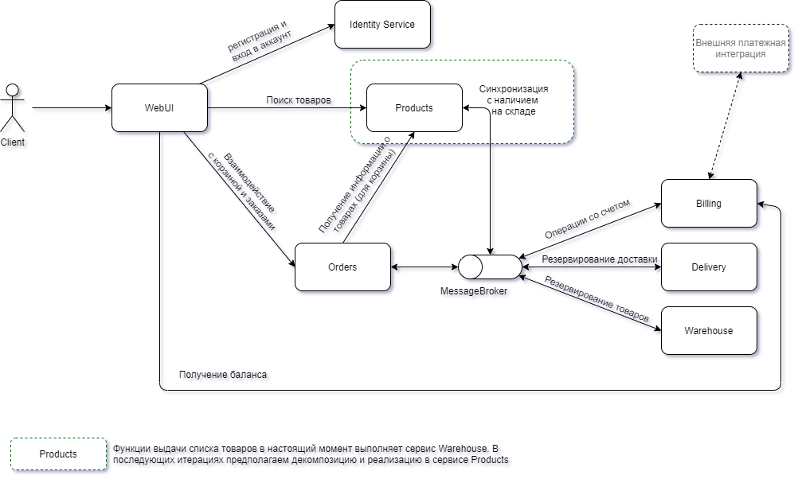
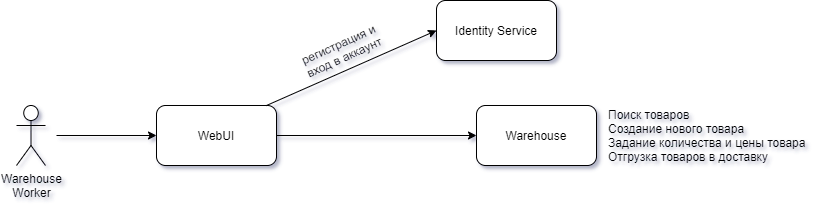
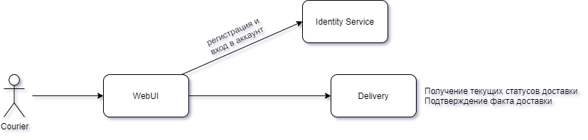
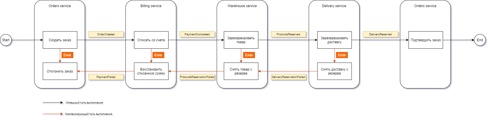
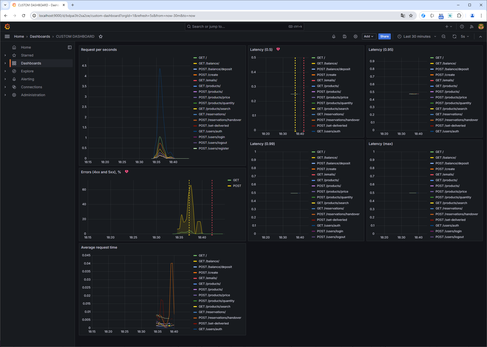
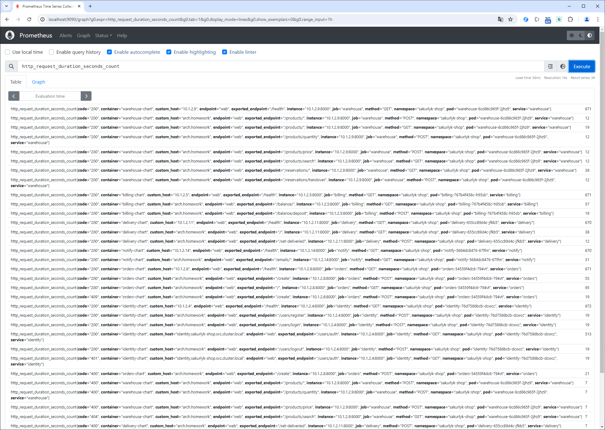
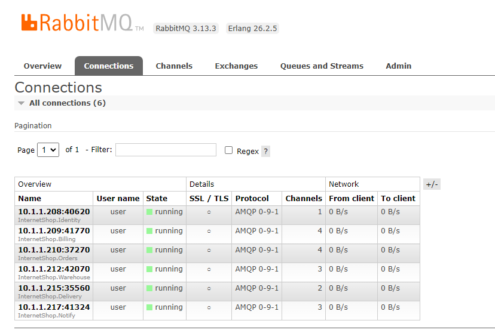

# ВКР Интернет-магазин с использованием микросервисной архитектуры

# Вводные для реализации
  
## Общая схема взаимодействия для роли "Покупатель"

  

## Общая схема взаимодействия для роли "Работник склада"
  
  
  
## Общая схема взаимодействия для роли "Курьер"
  
  
  
## Пользовательские истории
  
[Декомпозиция и пользовательские истории (Gerkin)](./assets/userstories/README.md)  
  
## Диаграммы последовательностей

[Регистрация нового пользователя](./assets/sequence/register_user.png)  
[Авторизация пользователя](./assets/sequence/authorize_user.png)  
[Запросы от авторизованного пользователя](./assets/sequence/authorized_user.png)  
[Запросы от неавторизованного пользователя](./assets/sequence/unauthorized_user.png)  
[Создание заказа (успешный сценарий)](./assets/sequence/create_order.png)  
[Создание заказа (поток событий при успешном и неуспешном сценарии)](./assets/image_saga.png)  
[Добавление новых продуктов на склад](./assets/sequence/product_addition_warehouse.png)  
[Отгрузка зарезервированных продуктов курьеру](./assets/sequence/product_handover_warehouse.png)  
[Подтверждение курьером факта доставки](./assets/sequence/confirm_delivery.png)  

## Поддержка идемпотентности запросов создания заказа.  
  
Фронтенд должен генерировать идентификатор запроса в формате `UUIDv4` и передавать его в заголовке запроса `X-Request-Id`.  
Для хранения данных заказов сервис использует таблицу `Orders`.  
Для хранения идентификаторов запроса сервис использует отдельную таблицу `ClientRequests`.  
Сервис, получая данные от клиента, сверяет полученный идентификатор запроса с данными в таблице `ClientRequests`.  
Если в таблице уже имеется такой же идентификатор, то сервис будет отправлять клиенту ответ с ошибкой `HTTP 409`.  
Если же такой идентификатор отсутствует, то сервис помещает данные заказа в таблицу Orders и данные идентификатора в таблицу `ClientRequests` клиенту успешный ответ `HTTP 200`.  
  
## Поддержка консистентности данных
  
Создание и подтверждение заказа проходит несколько стадий при межсервисном взаимодействии.
Поддрежку консистентности данных реализуем с использованием распределённой хореографической саги.
На нижеприведенной схеме показаны потоки данных прохождения транзакции в случае успеха и противотранзакции в случае возникновения ошибок.
  
  

## Поддержка аутентификации

Аутентификацию осуществляем на базе куки-сессий.  
Запросы фронтенда должны поступать через API-gateway (на базе nginx) и перенаправляться им для проверки текущей сессии пользователя в сервис Identity.  
  
Планируем итеративный переход:  
  
1 итерация: поддержка хранения сессии в распределенном кэше, для возможности горизонтального масштабирования сервисов.  
2 итерация: переход на jwt-токены.  
  
## Поддержка авторизации
  
Аутентификацию и авторизацию внутренних пользователей (работник склада и курьер) выполняем на базе ролевой модели с помощью keycloak.
Поддержку keycloak и ролевой модели предполагаем в следующую итерацию.  
  
## Развертывание 
  
Дальнейшие действия подразумевают, что Nginx Ingress Controller уже установлен.  
  
Создаем и делаем дефолтным неймспейс sakurlyk-shop
```
kubectl create namespace sakurlyk-shop
kubectl config set-context --current --namespace=sakurlyk-shop
```

Добавление bitnami репозитория (если еще не добавляли ранее).  
Данный репозиторий понадобится для установки rabbitmq.  
  
```
helm repo add bitnami https://charts.bitnami.com/bitnami
helm repo update bitnami
```

Устанавливаем rabbitmq с прокидыванием пароля password  
  
```
helm -n sakurlyk-shop install rabbitmq oci://registry-1.docker.io/bitnamicharts/rabbitmq --set auth.username=user,auth.password=password
```

Устанавливаем Prometheus и Grafana:

В папке Helm выполняем:

```
helm repo add prometheus-community https://prometheus-community.github.io/helm-charts
helm repo update
helm -n sakurlyk-shop install monitoring prometheus-community/kube-prometheus-stack -f .\kube-prometheus-stack\values.yaml
```

В папке Helm выполняем команды установки сервисов  
```
helm -n sakurlyk-shop install identity-chart .\identity-chart
helm -n sakurlyk-shop install billing-chart .\billing-chart
helm -n sakurlyk-shop install orders-chart .\orders-chart
helm -n sakurlyk-shop install warehouse-chart .\warehouse-chart
helm -n sakurlyk-shop install delivery-chart .\delivery-chart
helm -n sakurlyk-shop install notify-chart .\notify-chart
```
  
## Ingress

Для возможности обращения к ingress.  
В качестве namespace указываем тот, в котором установлен и работает ingress контроллер.  
В примере запуска ниже указан --namespace=m  
  
```
kubectl port-forward --namespace=m service/nginx-ingress-nginx-controller 80:80
```
  
## Grafana

После установки приложения dashboard с именем `CUSTOM DASHBOARD` и alert rules будут автоматически доступны в графане.  
  
Для возможности обращения к Grafana:  
  
```
kubectl port-forward --namespace=sakurlyk-shop service/monitoring-grafana 9000:80
```
  
Подключаемся по адресу http://localhost:9000  
  
Учетные данные пользователя Grafana:  
  
логин: admin  
пароль: password

Пример отображения данных на dashboard-е:



## Prometheus

Для возможности обращения к Prometheus (при необходимости):  
  
```
kubectl port-forward --namespace=sakurlyk-shop service/monitoring-kube-prometheus-prometheus 9090:9090
```
  
Подключаемся по адресу http://localhost:9090

Пример отображения данных на dashboard-е Prometheus-а:



  
## RabbitMq
  
Для возможности обращения к UI RabbitMq:  
  
```
kubectl port-forward --namespace sakurlyk-shop svc/rabbitmq 15672:15672
```
  
Подключаемся по адресу http://localhost:15672  
  
Учетные данные :  
  
```
логин: user  
пароль: password  
```
  
Пример интерфейса со списком подключений:  
  
  
  
## Тестирование

[Ссылка на результаты тестирования с использованием Postman](./postman/README.md)

Для успешного прохождения бизнес-процесса в момент тестирования необходимо выполнение следующих условий:  
  
- наличие у пользователя денежных средств на балансе счета.  
- наличие товара на складе в нужном количестве.  
  
В начале прохождения Postman-тестов товар создастся и счет пополнится.  
По мере прохождения тестов с баланса пользователя спишется часть средств и со склада отгрузится часть товара.
  
Запускаем тесты из папки 'Postman' с помощью newman и проверяем, что все корректно запустилось.  
  
```
newman run "internetshop.postman_collection.json" --delay-request 1000
```
