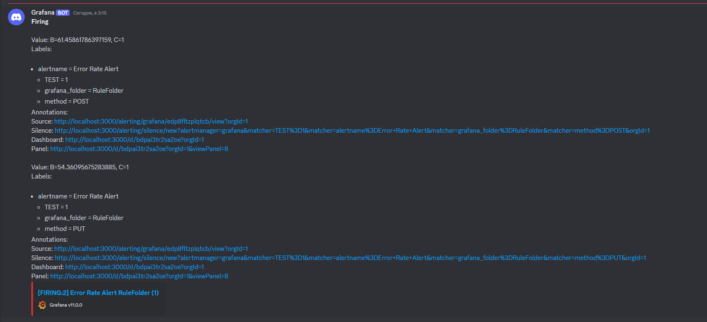

## Развертывание 

Дальнейшие действия подразумевают, что Nginx Ingress Controller уже установлен.

Создаем и делаем дефолтным неймспейс sakurlyk-lesson18
```
kubectl create namespace sakurlyk-lesson18
kubectl config set-context --current --namespace=sakurlyk-lesson18
```

В папке `Helm` выполняем команду установки сервиса приложения
```
helm -n sakurlyk-lesson18 install app-chart .\app-chart
```

Для возможности обращения к ingress.  
В качестве namespace указываем тот, в котором установлен и работает ingress контроллер.  
В примере запуска ниже указан --namespace=m

```
kubectl port-forward --namespace=m service/nginx-ingress-nginx-controller 80:80
```

## Тестирование
  
После установки приложение доступно по адресу:  
  
http://arch.homework/app/health   
    
Endpoint-ы:  
  
```
POST http://arch.homework/app/api/v1/users
GET http://arch.homework/app/api/v1/users
PUT http://arch.homework/app/api/v1/users/1
GET http://arch.homework/app/api/v1/users/1
DELETE http://arch.homework/app/api/v1/users/1
```
  
В папке `LoadTesting` находятся bat-файлы запуска отправки запросов.  
Использовалась утилита [hey](https://github.com/rakyll/hey).  
  

## Grafana

После установки приложения dashboard с именем `CUSTOM DASHBOARD` и alert rules будут автоматически доступны в графане.  
  
Для возможности обращения к Grafana:  
  
```
kubectl port-forward --namespace=sakurlyk-lesson18 service/app-chart-grafana 9000:80
```
  
Подключаемся по адресу http://localhost:9000  
  
Учетные данные пользователя Grafana:  
  
логин: admin  
пароль: password  
  
### Screenshots

#### Метрики


#### Настройки alert-ов


#### Пример поступления нотификации в Discord по срабатыванию alert-а



## Prometheus

Для возможности обращения к Prometheus (при необходимости):  
  
```
kubectl port-forward --namespace=sakurlyk-lesson18 service/app-chart-kube-prometheus-prometheus 9090:9090
```
  
Подключаемся по адресу http://localhost:9090