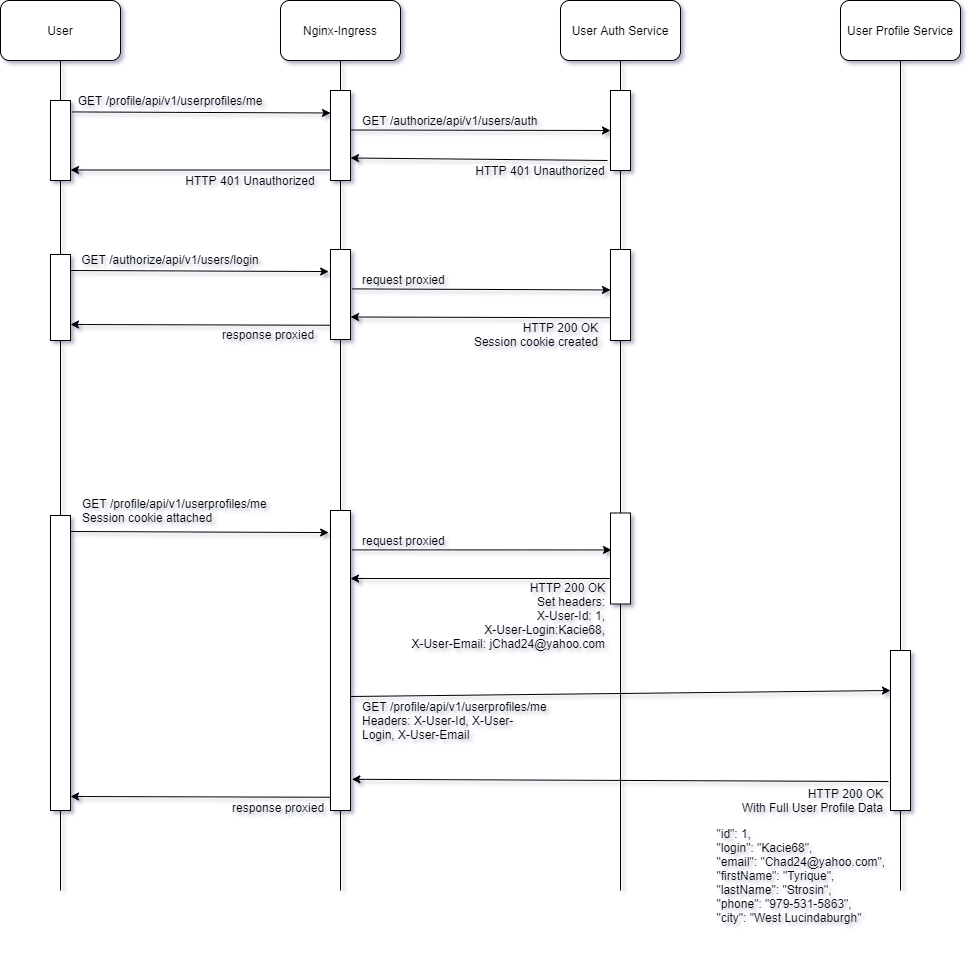

## Архитектура решения



Построено два независимых сервиса. Один для аутентификации пользователя, другой для изменения профиля пользователя.
Взаимодействие с сервисами выполняется через шлюз ApiGateway на базе Nginx Ingress Controller.
В качестве решения хранения данных об идентификаторе сессии пользователя используется базовая реализация на простых Cookie,
а уже сами креды пользователя закрыты/хранятся непосредственно в сервисе аутентификации.

## Развертывание 

Дальнейшие действия подразумевают, что Nginx Ingress Controller уже установлен.

Создаем и делаем дефолтным неймспейс sakurlyk-lesson21
```
kubectl create namespace sakurlyk-lesson21
kubectl config set-context --current --namespace=sakurlyk-lesson21
```

В папке Helm выполняем команду установки сервиса аутентификации
```
helm -n sakurlyk-lesson21 install auth-chart .\auth-chart
```

В папке Helm выполняем команду установки сервиса приложения
```
helm -n sakurlyk-lesson21 install app-chart .\app-chart
```

Для возможности обращения к ingress (в качестве namespace указываем тот, в котором установлен и работает ingress контроллер)

```
kubectl port-forward --namespace=m service/nginx-ingress-nginx-controller 80:80
```

## Тестирование

После установки запускаем тесты из папки 'Postman' с помощью newman и проверяем, что все корректно запустилось. 

```
newman run "lesson_21.postman_collection.json"
```

Результаты:

```
→ 01_Зарегистрировать User 1
  POST http://arch.homework/authorize/api/v1/users/register [201 Created, 240B, 194ms]

  √  [INFO] Request: {
  "login": "Kacie68",
  "password": "HiErkTBcoW_Wke9",
  "email": "Chad24@yahoo.com"
}
  √  [INFO] Response: {"id":1,"login":"Kacie68","email":"Chad24@yahoo.com"}
  √  HTTPStatus 201
```

```
→ 02_Попытка получить профиль без логина
  GET http://arch.homework/profiles/api/v1/userprofiles/me [401 Unauthorized, 308B, 11ms]

  √  [INFO] Request: [object Object]
  √  [INFO] Response: <html>
<head><title>401 Authorization Required</title></head>
<body>
<center><h1>401 Authorization Required</h1></center>
<hr><center>nginx</center>
</body>
</html>

  √  HTTPStatus 401
```

```
→ 03_Попытка изменения профиля без логина
  PUT http://arch.homework/profiles/api/v1/userprofiles/me [401 Unauthorized, 308B, 7ms]

  √  [INFO] Request: {
  "firstName": "Daphnee",
  "lastName": "McClure",
  "phone": "746-826-1729",
  "city": "New Brennanchester"
}
  √  [INFO] Response: <html>
<head><title>401 Authorization Required</title></head>
<body>
<center><h1>401 Authorization Required</h1></center>
<hr><center>nginx</center>
</body>
</html>

  √  HTTPStatus 401
```

```
→ 04_Логин User 1
  POST http://arch.homework/authorize/api/v1/users/login [200 OK, 208B, 227ms]

  √  [INFO] Request: {
  "login": "Kacie68",
  "password": "HiErkTBcoW_Wke9"
}
  √  [INFO] Response:
  √  HTTPStatus 200
  √  Session_id cookies set
```

```
→ 05_Изменение профиля после логина User 1
  PUT http://arch.homework/profiles/api/v1/userprofiles/me [200 OK, 301B, 299ms]

  √  [INFO] Request: {
  "firstName": "Tyrique",
  "lastName": "Strosin",
  "phone": "979-531-5863",
  "city": "West Lucindaburgh"
}
  √  [INFO] Response: {"id":1,"login":"Kacie68","email":"Chad24@yahoo.com","firstName":"Tyrique","lastName":"Strosin","phone":"979-531-5863","city":"West Lucindaburgh"}
  √  HTTPStatus 200
```

```
→ 06_Получение профиля после логина User 1
  GET http://arch.homework/profiles/api/v1/userprofiles/me [200 OK, 301B, 57ms]

  √  [INFO] Request: [object Object]
  √  [INFO] Response: {"id":1,"login":"Kacie68","email":"Chad24@yahoo.com","firstName":"Tyrique","lastName":"Strosin","phone":"979-531-5863","city":"West Lucindaburgh"}
  √  HTTPStatus 200
  √  First name is actual after editing
  √  Last name is actual after editing
  √  Phone is actual after editing
  √  City is actual after editing
```

```
→ 07_Логаут User 1
  POST http://arch.homework/authorize/api/v1/users/logout [200 OK, 186B, 7ms]

  √  [INFO] Request: [object Object]
  √  [INFO] Response:
  √  HTTPStatus 200
  √  Session_id cookies is not set
```

```
→ 08_Получение профиля после разлогина User 1
  GET http://arch.homework/profiles/api/v1/userprofiles/me [401 Unauthorized, 308B, 6ms]

  √  [INFO] Request: [object Object]
  √  [INFO] Response: <html>
<head><title>401 Authorization Required</title></head>
<body>
<center><h1>401 Authorization Required</h1></center>
<hr><center>nginx</center>
</body>
</html>

  √  HTTPStatus 401
```

```
→ 09_Зарегистрировать User 2
  POST http://arch.homework/authorize/api/v1/users/register [201 Created, 256B, 11ms]

  √  [INFO] Request: {
  "login": "Jaclyn89",
  "password": "tG7Yo8mZ4RUTPZC",
  "email": "Kaitlin_Bahringer93@hotmail.com"
}
  √  [INFO] Response: {"id":2,"login":"Jaclyn89","email":"Kaitlin_Bahringer93@hotmail.com"}
  √  HTTPStatus 201
```

```
→ 10_Логин User 2
  POST http://arch.homework/authorize/api/v1/users/login [200 OK, 208B, 10ms]

  √  [INFO] Request: {
  "login": "Jaclyn89",
  "password": "tG7Yo8mZ4RUTPZC"
}
  √  [INFO] Response:
  √  HTTPStatus 200
  √  Session_id cookies set
```

```
→ 11_Получение профиля после логина User 2 и проверка что этот не профиль пользователя User 1
  GET http://arch.homework/profiles/api/v1/userprofiles/me [200 OK, 282B, 13ms]

  √  [INFO] Request: [object Object]
  √  [INFO] Response: {"id":2,"login":"Jaclyn89","email":"Kaitlin_Bahringer93@hotmail.com","firstName":null,"lastName":null,"phone":null,"city":null}
  √  HTTPStatus 200
  √  User id is not equal to FirstUser_Id
  √  Login is not equal to FirstUser_Login
  √  Email is not equal to FirstUser_Email
  √  First name is not equal to FirstUser_FirstName
  √  Last name is not equal to FirstUser_LastName
  √  Phone is not equal to FirstUser_Phone
  √  City is not equal to FirstUser_City
```

```
→ 12_Изменение профиля после логина User 2 и проверка что этот не профиль пользователя User 1
  PUT http://arch.homework/profiles/api/v1/userprofiles/me [200 OK, 317B, 12ms]

  √  [INFO] Request: {
  "firstName": "Tyrique",
  "lastName": "Strosin",
  "phone": "979-531-5863",
  "city": "West Lucindaburgh"
}
  √  [INFO] Response: {"id":2,"login":"Jaclyn89","email":"Kaitlin_Bahringer93@hotmail.com","firstName":"Tyrique","lastName":"Strosin","phone":"979-531-5863","city":"West Lucindaburgh"}
  √  HTTPStatus 200
  √  User id is not equal to FirstUser_Id
  √  Login is not equal to FirstUser_Login
  √  Email is not equal to FirstUser_Email
```

```
┌─────────────────────────┬───────────────────┬───────────────────┐
│                         │          executed │            failed │
├─────────────────────────┼───────────────────┼───────────────────┤
│              iterations │                 1 │                 0 │
├─────────────────────────┼───────────────────┼───────────────────┤
│                requests │                12 │                 0 │
├─────────────────────────┼───────────────────┼───────────────────┤
│            test-scripts │                24 │                 0 │
├─────────────────────────┼───────────────────┼───────────────────┤
│      prerequest-scripts │                19 │                 0 │
├─────────────────────────┼───────────────────┼───────────────────┤
│              assertions │                53 │                 0 │
├─────────────────────────┴───────────────────┴───────────────────┤
│ total run duration: 1861ms                                      │
├─────────────────────────────────────────────────────────────────┤
│ total data received: 1.22kB (approx)                            │
├─────────────────────────────────────────────────────────────────┤
│ average response time: 71ms [min: 6ms, max: 299ms, s.d.: 100ms] │
└─────────────────────────────────────────────────────────────────┘
```