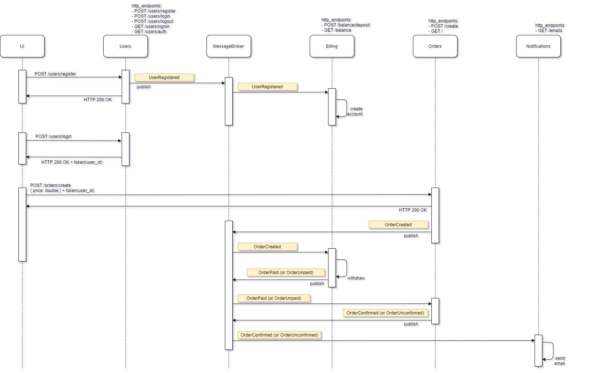
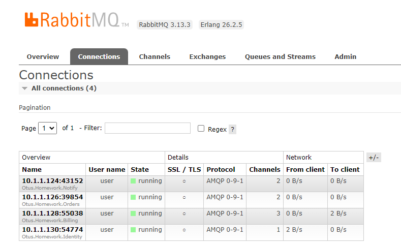

## Возможные варианты взаимодействий

Схемы sequence-диаграмм различных вариантов:  
  
[Только HTTP взаимодействие](./assets/01_arch_only_rest.png)  
[Событийное взаимодействие с использование брокера сообщений](./assets/02_arch_rest_and_messagebroker.png)  
[Event Collaboration cтиль взаимодействия с использованием брокера сообщений](./assets/03_arch_event_collaboration.png)  
  
## Архитектура реализованного решения

Для выполнения задания выбран вариант реализации `Event Collaboration`.

  

## Развертывание 
  
Дальнейшие действия подразумевают, что Nginx Ingress Controller уже установлен.  
  
Создаем и делаем дефолтным неймспейс sakurlyk-lesson26
```
kubectl create namespace sakurlyk-lesson26
kubectl config set-context --current --namespace=sakurlyk-lesson26
```

Устанавливаем rabbitmq с прокидыванием пароля password  
```
helm -n sakurlyk-lesson26 install rabbitmq oci://registry-1.docker.io/bitnamicharts/rabbitmq --set auth.username=user,auth.password=password
```

В папке Helm выполняем команды установки сервисов  
```
helm -n sakurlyk-lesson26 install identity-chart .\identity-chart
helm -n sakurlyk-lesson26 install billing-chart .\billing-chart
helm -n sakurlyk-lesson26 install orders-chart .\orders-chart
helm -n sakurlyk-lesson26 install notify-chart .\notify-chart
```
  
## Ingress

Для возможности обращения к ingress.  
В качестве namespace указываем тот, в котором установлен и работает ingress контроллер.  
В примере запуска ниже указан --namespace=m  
  
```
kubectl port-forward --namespace=m service/nginx-ingress-nginx-controller 80:80
```
  
## RabbitMq
  
Для возможности обращения к UI RabbitMq:  
  
```
kubectl port-forward --namespace sakurlyk-lesson26 svc/rabbitmq 15672:15672
```
  
Подключаемся по адресу http://localhost:15672  
  
Учетные данные :  
  
```
логин: user  
пароль: password  
```
  
Пример интерфейса со списком подключений:  
  
  
  
## Тестирование
  
После установки запускаем тесты из папки 'Postman' с помощью newman и проверяем, что все корректно запустилось.  
  
```
newman run "lesson_26.postman_collection.json"
```
  
Результаты:

```
→ 01_Зарегистрировать пользователя
  POST http://arch.homework/identity/users/register [200 OK, 208B, 301ms]
  √  [INFO] Request headers: [{"key":"Content-Type","value":"application/json","system":true},{"key":"User-Agent","value":"PostmanRuntime/7.39.0","system":true},{"key":"Accept","value":"*/*","system":true},{"key":"Cache-Control","value":"no-cache","system":true},{"key":"Postman-Token","value":"504636fe-e104-42fa-9f48-74abaf530396","system":true},{"key":"Host","value":"arch.homework","system":true},{"key":"Accept-Encoding","value":"gzip, deflate, br","system":true},{"key":"Connection","value":"keep-alive","system":true},{"key":"Content-Length","value":"92","system":true}]
  √  [INFO] Request body: {
  "login": "Gerda2",
  "password": "ossFzJcBMWqqi7y",
  "email": "Pat74@hotmail.com"
}
  √  [INFO] Response headers: [{"key":"Date","value":"Sat, 22 Jun 2024 23:01:50 GMT"},{"key":"Content-Type","value":"application/json; charset=utf-8"},{"key":"Transfer-Encoding","value":"chunked"},{"key":"Connection","value":"keep-alive"}]
  √  [INFO] Response body: {"id":3,"login":"Gerda2","email":"Pat74@hotmail.com"}
  √  HTTPStatus 200

→ 02_Логин пользователя
  POST http://arch.homework/identity/users/login [200 OK, 418B, 10ms]
  √  [INFO] Request headers: [{"key":"Content-Type","value":"application/json","system":true},{"key":"User-Agent","value":"PostmanRuntime/7.39.0","system":true},{"key":"Accept","value":"*/*","system":true},{"key":"Cache-Control","value":"no-cache","system":true},{"key":"Postman-Token","value":"af354cbd-ef90-42fe-a27e-1e1d76ab55fc","system":true},{"key":"Host","value":"arch.homework","system":true},{"key":"Accept-Encoding","value":"gzip, deflate, br","system":true},{"key":"Connection","value":"keep-alive","system":true},{"key":"Content-Length","value":"59","system":true}]
  √  [INFO] Request body: {
  "login": "Gerda2",
  "password": "ossFzJcBMWqqi7y"
}
  √  [INFO] Response headers: [{"key":"Date","value":"Sat, 22 Jun 2024 23:01:50 GMT"},{"key":"Content-Length","value":"0"},{"key":"Connection","value":"keep-alive"},{"key":"Cache-Control","value":"no-cache,no-store"},{"key":"Expires","value":"-1"},{"key":"Pragma","value":"no-cache"},{"key":"Set-Cookie","value":"sakurlyk.identity.session=CfDJ8MrUggw6RgRArqIbNG0T%2B0swYRECjlLGC2vq8XvSZaOfQixSiCgKURtHZsONb5GTMBv3uFjGbYXaXQRhasJ4cZo7cTs3XrrFqnDAWyASNu%2BH9mMyrs8sZSjuba2HbT7%2B6bHCAaWedyeD7M428puiIeGGpg4igSYXRQNZWxSHD7ex; path=/; samesite=lax; httponly"}]
  √  [INFO] Response body:
  √  HTTPStatus 200
  √  Session cookies set

→ 03_Получение баланса (=0)
  GET http://arch.homework/billing/balance [200 OK, 168B, 11ms]
  √  [INFO] Request headers: [{"key":"User-Agent","value":"PostmanRuntime/7.39.0","system":true},{"key":"Accept","value":"*/*","system":true},{"key":"Cache-Control","value":"no-cache","system":true},{"key":"Postman-Token","value":"4e7dd5b5-38b9-4565-8a2a-e28ddde6ef0a","system":true},{"key":"Host","value":"arch.homework","system":true},{"key":"Accept-Encoding","value":"gzip, deflate, br","system":true},{"key":"Connection","value":"keep-alive","system":true},{"key":"Cookie","value":"sakurlyk.identity.session=CfDJ8MrUggw6RgRArqIbNG0T%2B0swYRECjlLGC2vq8XvSZaOfQixSiCgKURtHZsONb5GTMBv3uFjGbYXaXQRhasJ4cZo7cTs3XrrFqnDAWyASNu%2BH9mMyrs8sZSjuba2HbT7%2B6bHCAaWedyeD7M428puiIeGGpg4igSYXRQNZWxSHD7ex","system":true}]
  √  [INFO] Request body: undefined
  √  [INFO] Response headers: [{"key":"Date","value":"Sat, 22 Jun 2024 23:01:50 GMT"},{"key":"Content-Type","value":"application/json; charset=utf-8"},{"key":"Transfer-Encoding","value":"chunked"},{"key":"Connection","value":"keep-alive"}]
  √  [INFO] Response body: {"balance":0}
  √  HTTPStatus 200
  √  Session cookies set
  √  Balance is 0

→ 04_Пополнить баланс на 400
  POST http://arch.homework/billing/balance/deposit [200 OK, 99B, 9ms]
  √  [INFO] Request headers: [{"key":"Content-Type","value":"application/json","system":true},{"key":"User-Agent","value":"PostmanRuntime/7.39.0","system":true},{"key":"Accept","value":"*/*","system":true},{"key":"Cache-Control","value":"no-cache","system":true},{"key":"Postman-Token","value":"6c8410c5-5dba-4e8c-97fb-60e4fc17f030","system":true},{"key":"Host","value":"arch.homework","system":true},{"key":"Accept-Encoding","value":"gzip, deflate, br","system":true},{"key":"Connection","value":"keep-alive","system":true},{"key":"Content-Length","value":"25","system":true},{"key":"Cookie","value":"sakurlyk.identity.session=CfDJ8MrUggw6RgRArqIbNG0T%2B0swYRECjlLGC2vq8XvSZaOfQixSiCgKURtHZsONb5GTMBv3uFjGbYXaXQRhasJ4cZo7cTs3XrrFqnDAWyASNu%2BH9mMyrs8sZSjuba2HbT7%2B6bHCAaWedyeD7M428puiIeGGpg4igSYXRQNZWxSHD7ex","system":true}]
  √  [INFO] Request body: {
  "amount": "400.0"
}
  √  [INFO] Response headers: [{"key":"Date","value":"Sat, 22 Jun 2024 23:01:51 GMT"},{"key":"Content-Length","value":"0"},{"key":"Connection","value":"keep-alive"}]
  √  [INFO] Response body:
  √  HTTPStatus 200
  √  Session cookies set

→ 05_Получение баланса (=400)
  GET http://arch.homework/billing/balance [200 OK, 172B, 7ms]
  √  [INFO] Request headers: [{"key":"User-Agent","value":"PostmanRuntime/7.39.0","system":true},{"key":"Accept","value":"*/*","system":true},{"key":"Cache-Control","value":"no-cache","system":true},{"key":"Postman-Token","value":"3586b35c-b99a-4ffa-8829-009005871b38","system":true},{"key":"Host","value":"arch.homework","system":true},{"key":"Accept-Encoding","value":"gzip, deflate, br","system":true},{"key":"Connection","value":"keep-alive","system":true},{"key":"Cookie","value":"sakurlyk.identity.session=CfDJ8MrUggw6RgRArqIbNG0T%2B0swYRECjlLGC2vq8XvSZaOfQixSiCgKURtHZsONb5GTMBv3uFjGbYXaXQRhasJ4cZo7cTs3XrrFqnDAWyASNu%2BH9mMyrs8sZSjuba2HbT7%2B6bHCAaWedyeD7M428puiIeGGpg4igSYXRQNZWxSHD7ex","system":true}]
  √  [INFO] Request body: undefined
  √  [INFO] Response headers: [{"key":"Date","value":"Sat, 22 Jun 2024 23:01:51 GMT"},{"key":"Content-Type","value":"application/json; charset=utf-8"},{"key":"Transfer-Encoding","value":"chunked"},{"key":"Connection","value":"keep-alive"}]
  √  [INFO] Response body: {"balance":400.0}
  √  HTTPStatus 200
  √  Session cookies set
  √  Balance is 400

→ 06_Получение списка заказов (=заказов нет)
  GET http://arch.homework/orders [404 Not Found, 254B, 7ms]
  √  [INFO] Request headers: [{"key":"User-Agent","value":"PostmanRuntime/7.39.0","system":true},{"key":"Accept","value":"*/*","system":true},{"key":"Cache-Control","value":"no-cache","system":true},{"key":"Postman-Token","value":"4aa911ce-ace1-42d3-a25d-2c18f359e2f5","system":true},{"key":"Host","value":"arch.homework","system":true},{"key":"Accept-Encoding","value":"gzip, deflate, br","system":true},{"key":"Connection","value":"keep-alive","system":true},{"key":"Cookie","value":"sakurlyk.identity.session=CfDJ8MrUggw6RgRArqIbNG0T%2B0swYRECjlLGC2vq8XvSZaOfQixSiCgKURtHZsONb5GTMBv3uFjGbYXaXQRhasJ4cZo7cTs3XrrFqnDAWyASNu%2BH9mMyrs8sZSjuba2HbT7%2B6bHCAaWedyeD7M428puiIeGGpg4igSYXRQNZWxSHD7ex","system":true}]
  √  [INFO] Request body: undefined
  √  [INFO] Response headers: [{"key":"Date","value":"Sat, 22 Jun 2024 23:01:51 GMT"},{"key":"Content-Type","value":"application/json; charset=utf-8"},{"key":"Transfer-Encoding","value":"chunked"},{"key":"Connection","value":"keep-alive"}]
  √  [INFO] Response body: {"message":"Заказы пользователя не существуют","details":null}
  √  HTTPStatus 404
  √  Session cookies set

→ 07_Создать заказ на 100
  POST http://arch.homework/orders/create [200 OK, 297B, 59ms]
  √  [INFO] Request headers: [{"key":"Content-Type","value":"application/json","system":true},{"key":"User-Agent","value":"PostmanRuntime/7.39.0","system":true},{"key":"Accept","value":"*/*","system":true},{"key":"Cache-Control","value":"no-cache","system":true},{"key":"Postman-Token","value":"3596e9a5-9838-4882-bc37-337ebb1e5823","system":true},{"key":"Host","value":"arch.homework","system":true},{"key":"Accept-Encoding","value":"gzip, deflate, br","system":true},{"key":"Connection","value":"keep-alive","system":true},{"key":"Content-Length","value":"29","system":true},{"key":"Cookie","value":"sakurlyk.identity.session=CfDJ8MrUggw6RgRArqIbNG0T%2B0swYRECjlLGC2vq8XvSZaOfQixSiCgKURtHZsONb5GTMBv3uFjGbYXaXQRhasJ4cZo7cTs3XrrFqnDAWyASNu%2BH9mMyrs8sZSjuba2HbT7%2B6bHCAaWedyeD7M428puiIeGGpg4igSYXRQNZWxSHD7ex","system":true}]
  √  [INFO] Request body: {
  "totalPrice": "100.0"
}
  √  [INFO] Response headers: [{"key":"Date","value":"Sat, 22 Jun 2024 23:01:51 GMT"},{"key":"Content-Type","value":"application/json; charset=utf-8"},{"key":"Transfer-Encoding","value":"chunked"},{"key":"Connection","value":"keep-alive"}]
  √  [INFO] Response body: {"id":"2e9f681b-50e5-4465-b810-233a9877b836","userId":3,"totalPrice":100.0,"status":"Created","createdAt":"2024-06-22T23:01:51.2230461+00:00"}
  √  HTTPStatus 200
  √  Session cookies set
  √  Order with totalPrice=100.0 created

→ 08_Получение баланса (=300)
  GET http://arch.homework/billing/balance [200 OK, 172B, 7ms]
  √  [INFO] Request headers: [{"key":"User-Agent","value":"PostmanRuntime/7.39.0","system":true},{"key":"Accept","value":"*/*","system":true},{"key":"Cache-Control","value":"no-cache","system":true},{"key":"Postman-Token","value":"54995c90-e46f-447a-b59c-cdc9ae9fd698","system":true},{"key":"Host","value":"arch.homework","system":true},{"key":"Accept-Encoding","value":"gzip, deflate, br","system":true},{"key":"Connection","value":"keep-alive","system":true},{"key":"Cookie","value":"sakurlyk.identity.session=CfDJ8MrUggw6RgRArqIbNG0T%2B0swYRECjlLGC2vq8XvSZaOfQixSiCgKURtHZsONb5GTMBv3uFjGbYXaXQRhasJ4cZo7cTs3XrrFqnDAWyASNu%2BH9mMyrs8sZSjuba2HbT7%2B6bHCAaWedyeD7M428puiIeGGpg4igSYXRQNZWxSHD7ex","system":true}]
  √  [INFO] Request body: undefined
  √  [INFO] Response headers: [{"key":"Date","value":"Sat, 22 Jun 2024 23:01:51 GMT"},{"key":"Content-Type","value":"application/json; charset=utf-8"},{"key":"Transfer-Encoding","value":"chunked"},{"key":"Connection","value":"keep-alive"}]
  √  [INFO] Response body: {"balance":300.0}
  √  HTTPStatus 200
  √  Session cookies set
  √  Balance is 300

→ 09_Получение списка заказов (=заказ подтвержден)
  GET http://arch.homework/orders [200 OK, 300B, 7ms]
  √  [INFO] Request headers: [{"key":"User-Agent","value":"PostmanRuntime/7.39.0","system":true},{"key":"Accept","value":"*/*","system":true},{"key":"Cache-Control","value":"no-cache","system":true},{"key":"Postman-Token","value":"016185a7-0539-4b6b-a2ff-2055c3d7611c","system":true},{"key":"Host","value":"arch.homework","system":true},{"key":"Accept-Encoding","value":"gzip, deflate, br","system":true},{"key":"Connection","value":"keep-alive","system":true},{"key":"Cookie","value":"sakurlyk.identity.session=CfDJ8MrUggw6RgRArqIbNG0T%2B0swYRECjlLGC2vq8XvSZaOfQixSiCgKURtHZsONb5GTMBv3uFjGbYXaXQRhasJ4cZo7cTs3XrrFqnDAWyASNu%2BH9mMyrs8sZSjuba2HbT7%2B6bHCAaWedyeD7M428puiIeGGpg4igSYXRQNZWxSHD7ex","system":true}]
  √  [INFO] Request body: undefined
  √  [INFO] Response headers: [{"key":"Date","value":"Sat, 22 Jun 2024 23:01:51 GMT"},{"key":"Content-Type","value":"application/json; charset=utf-8"},{"key":"Transfer-Encoding","value":"chunked"},{"key":"Connection","value":"keep-alive"}]
  √  [INFO] Response body: [{"id":"2e9f681b-50e5-4465-b810-233a9877b836","userId":3,"totalPrice":100.0,"status":"Confirmed","createdAt":"2024-06-22T23:01:51.223046+00:00"}]
  √  HTTPStatus 200
  √  Session cookies set
  √  Last order confirmed

→ 10_Получение нотификации с Поздравлением
  GET http://arch.homework/notify/emails [200 OK, 316B, 8ms]
  √  [INFO] Request headers: [{"key":"User-Agent","value":"PostmanRuntime/7.39.0","system":true},{"key":"Accept","value":"*/*","system":true},{"key":"Cache-Control","value":"no-cache","system":true},{"key":"Postman-Token","value":"3f18ae64-e6bc-4590-b663-d9a781744642","system":true},{"key":"Host","value":"arch.homework","system":true},{"key":"Accept-Encoding","value":"gzip, deflate, br","system":true},{"key":"Connection","value":"keep-alive","system":true},{"key":"Cookie","value":"sakurlyk.identity.session=CfDJ8MrUggw6RgRArqIbNG0T%2B0swYRECjlLGC2vq8XvSZaOfQixSiCgKURtHZsONb5GTMBv3uFjGbYXaXQRhasJ4cZo7cTs3XrrFqnDAWyASNu%2BH9mMyrs8sZSjuba2HbT7%2B6bHCAaWedyeD7M428puiIeGGpg4igSYXRQNZWxSHD7ex","system":true}]
  √  [INFO] Request body: undefined
  √  [INFO] Response headers: [{"key":"Date","value":"Sat, 22 Jun 2024 23:01:51 GMT"},{"key":"Content-Type","value":"application/json; charset=utf-8"},{"key":"Transfer-Encoding","value":"chunked"},{"key":"Connection","value":"keep-alive"}]
  √  [INFO] Response body: [{"userId":3,"message":"Congratulations! Order '2e9f681b-50e5-4465-b810-233a9877b836' is confirmed for user '3'","createdAt":"2024-06-22T23:01:51.239725+00:00"}]
  √  HTTPStatus 200
  √  Session cookies set
  √  Last notification with Congratulations

→ 11_Создать заказ на 500
  POST http://arch.homework/orders/create [200 OK, 297B, 13ms]
  √  [INFO] Request headers: [{"key":"Content-Type","value":"application/json","system":true},{"key":"User-Agent","value":"PostmanRuntime/7.39.0","system":true},{"key":"Accept","value":"*/*","system":true},{"key":"Cache-Control","value":"no-cache","system":true},{"key":"Postman-Token","value":"e095017d-c9c6-44f9-bad3-2c5b30c2dbf5","system":true},{"key":"Host","value":"arch.homework","system":true},{"key":"Accept-Encoding","value":"gzip, deflate, br","system":true},{"key":"Connection","value":"keep-alive","system":true},{"key":"Content-Length","value":"29","system":true},{"key":"Cookie","value":"sakurlyk.identity.session=CfDJ8MrUggw6RgRArqIbNG0T%2B0swYRECjlLGC2vq8XvSZaOfQixSiCgKURtHZsONb5GTMBv3uFjGbYXaXQRhasJ4cZo7cTs3XrrFqnDAWyASNu%2BH9mMyrs8sZSjuba2HbT7%2B6bHCAaWedyeD7M428puiIeGGpg4igSYXRQNZWxSHD7ex","system":true}]
  √  [INFO] Request body: {
  "totalPrice": "500.0"
}
  √  [INFO] Response headers: [{"key":"Date","value":"Sat, 22 Jun 2024 23:01:51 GMT"},{"key":"Content-Type","value":"application/json; charset=utf-8"},{"key":"Transfer-Encoding","value":"chunked"},{"key":"Connection","value":"keep-alive"}]
  √  [INFO] Response body: {"id":"e1020649-38d7-4313-b2d9-f34f6110a3c3","userId":3,"totalPrice":500.0,"status":"Created","createdAt":"2024-06-22T23:01:51.5946811+00:00"}
  √  HTTPStatus 200
  √  Session cookies set
  √  Order with totalPrice=500.0 created

→ 12_Получение баланса (=300)
  GET http://arch.homework/billing/balance [200 OK, 172B, 7ms]
  √  [INFO] Request headers: [{"key":"User-Agent","value":"PostmanRuntime/7.39.0","system":true},{"key":"Accept","value":"*/*","system":true},{"key":"Cache-Control","value":"no-cache","system":true},{"key":"Postman-Token","value":"4113d009-6393-4b69-bb2f-72b3f06d9c98","system":true},{"key":"Host","value":"arch.homework","system":true},{"key":"Accept-Encoding","value":"gzip, deflate, br","system":true},{"key":"Connection","value":"keep-alive","system":true},{"key":"Cookie","value":"sakurlyk.identity.session=CfDJ8MrUggw6RgRArqIbNG0T%2B0swYRECjlLGC2vq8XvSZaOfQixSiCgKURtHZsONb5GTMBv3uFjGbYXaXQRhasJ4cZo7cTs3XrrFqnDAWyASNu%2BH9mMyrs8sZSjuba2HbT7%2B6bHCAaWedyeD7M428puiIeGGpg4igSYXRQNZWxSHD7ex","system":true}]
  √  [INFO] Request body: undefined
  √  [INFO] Response headers: [{"key":"Date","value":"Sat, 22 Jun 2024 23:01:51 GMT"},{"key":"Content-Type","value":"application/json; charset=utf-8"},{"key":"Transfer-Encoding","value":"chunked"},{"key":"Connection","value":"keep-alive"}]
  √  [INFO] Response body: {"balance":300.0}
  √  HTTPStatus 200
  √  Session cookies set
  √  Balance is 300

→ 13_Получение списка заказов (=заказ не подтвержден)
  GET http://arch.homework/orders [200 OK, 446B, 7ms]
  √  [INFO] Request headers: [{"key":"User-Agent","value":"PostmanRuntime/7.39.0","system":true},{"key":"Accept","value":"*/*","system":true},{"key":"Cache-Control","value":"no-cache","system":true},{"key":"Postman-Token","value":"998601d0-456c-4bb9-9e2d-50473414ccc5","system":true},{"key":"Host","value":"arch.homework","system":true},{"key":"Accept-Encoding","value":"gzip, deflate, br","system":true},{"key":"Connection","value":"keep-alive","system":true},{"key":"Cookie","value":"sakurlyk.identity.session=CfDJ8MrUggw6RgRArqIbNG0T%2B0swYRECjlLGC2vq8XvSZaOfQixSiCgKURtHZsONb5GTMBv3uFjGbYXaXQRhasJ4cZo7cTs3XrrFqnDAWyASNu%2BH9mMyrs8sZSjuba2HbT7%2B6bHCAaWedyeD7M428puiIeGGpg4igSYXRQNZWxSHD7ex","system":true}]
  √  [INFO] Request body: undefined
  √  [INFO] Response headers: [{"key":"Date","value":"Sat, 22 Jun 2024 23:01:51 GMT"},{"key":"Content-Type","value":"application/json; charset=utf-8"},{"key":"Transfer-Encoding","value":"chunked"},{"key":"Connection","value":"keep-alive"}]
  √  [INFO] Response body: [{"id":"e1020649-38d7-4313-b2d9-f34f6110a3c3","userId":3,"totalPrice":500.0,"status":"Unconfirmed","createdAt":"2024-06-22T23:01:51.594681+00:00"},{"id":"2e9f681b-50e5-4465-b810-233a9877b836","userId":3,"totalPrice":100.0,"status":"Confirmed","createdAt":"2024-06-22T23:01:51.223046+00:00"}]
  √  HTTPStatus 200
  √  Session cookies set
  √  Last order unconfirmed

→ 14_Получение нотификации с Сожалением
  GET http://arch.homework/notify/emails [200 OK, 470B, 7ms]
  √  [INFO] Request headers: [{"key":"User-Agent","value":"PostmanRuntime/7.39.0","system":true},{"key":"Accept","value":"*/*","system":true},{"key":"Cache-Control","value":"no-cache","system":true},{"key":"Postman-Token","value":"5ccb1e44-566f-488c-a6d8-e872a4f971a6","system":true},{"key":"Host","value":"arch.homework","system":true},{"key":"Accept-Encoding","value":"gzip, deflate, br","system":true},{"key":"Connection","value":"keep-alive","system":true},{"key":"Cookie","value":"sakurlyk.identity.session=CfDJ8MrUggw6RgRArqIbNG0T%2B0swYRECjlLGC2vq8XvSZaOfQixSiCgKURtHZsONb5GTMBv3uFjGbYXaXQRhasJ4cZo7cTs3XrrFqnDAWyASNu%2BH9mMyrs8sZSjuba2HbT7%2B6bHCAaWedyeD7M428puiIeGGpg4igSYXRQNZWxSHD7ex","system":true}]
  √  [INFO] Request body: undefined
  √  [INFO] Response headers: [{"key":"Date","value":"Sat, 22 Jun 2024 23:01:51 GMT"},{"key":"Content-Type","value":"application/json; charset=utf-8"},{"key":"Transfer-Encoding","value":"chunked"},{"key":"Connection","value":"keep-alive"}]
  √  [INFO] Response body: [{"userId":3,"message":"Sorry. Order 'e1020649-38d7-4313-b2d9-f34f6110a3c3' is not confirmed for user '3'","createdAt":"2024-06-22T23:01:51.607321+00:00"},{"userId":3,"message":"Congratulations! Order '2e9f681b-50e5-4465-b810-233a9877b836' is confirmed for user '3'","createdAt":"2024-06-22T23:01:51.239725+00:00"}]
  √  HTTPStatus 200
  √  Session cookies set
  √  Last notification with Congratulations

┌─────────────────────────┬───────────────────┬──────────────────┐
│                         │          executed │           failed │
├─────────────────────────┼───────────────────┼──────────────────┤
│              iterations │                 1 │                0 │
├─────────────────────────┼───────────────────┼──────────────────┤
│                requests │                14 │                0 │
├─────────────────────────┼───────────────────┼──────────────────┤
│            test-scripts │                28 │                0 │
├─────────────────────────┼───────────────────┼──────────────────┤
│      prerequest-scripts │                25 │                0 │
├─────────────────────────┼───────────────────┼──────────────────┤
│              assertions │                93 │                0 │
├─────────────────────────┴───────────────────┴──────────────────┤
│ total run duration: 1628ms                                     │
├────────────────────────────────────────────────────────────────┤
│ total data received: 1.41kB (approx)                           │
├────────────────────────────────────────────────────────────────┤
│ average response time: 32ms [min: 7ms, max: 301ms, s.d.: 75ms] │
└────────────────────────────────────────────────────────────────┘
```