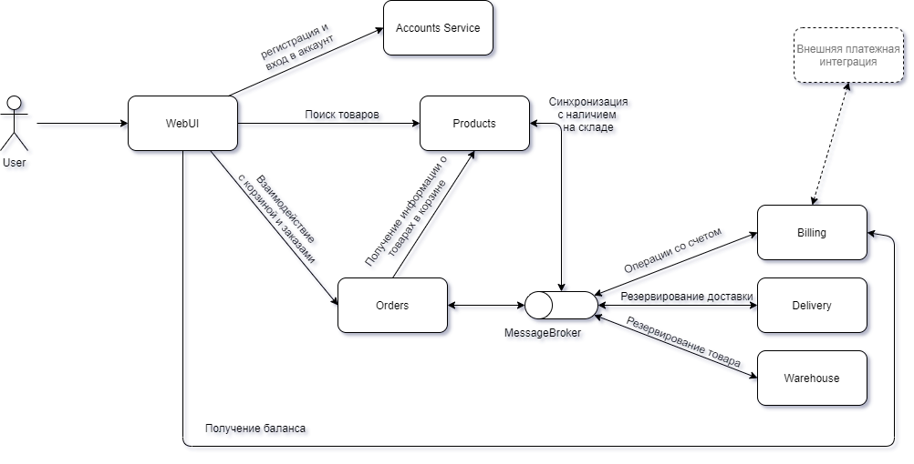

# LESSON-3 Паттерны декомпозиции микросервисов

# Декомпозиция интернет магазина.  

## Пользовательские сценарии
  
```
История: Регистрация пользовательского аккаунта.

Как пользователь, чтобы получить возможность совершать покупки,
Я хочу чтобы я был зарегистрирован на сайте интернет магазина.
Сценарий: 
Имеется сайт сервиса интернет магазина с кнопкой регистрации.
Когда пользователь нажимает на кнопку регистрации появляется форма заполнения сведений о пользователе, 
включающее логин и пароль и адрес электронной почты и кнопку подтверждения регистрации.
И пользователь заполняет представленную форму.
И нажимает кнопку подтверждения.
Тогда создаётся аккаунт пользователя в интернет магазине.
```

```
История: Вход пользователя.

Как пользователь, чтобы получить возможность совершать покупки, 
Я хочу войти в аккаунт интернет магазина с помощью данных введенных при регистрации аккаунта.
Сценарий:
Имеется сайт сервиса интернет магазина с кнопкой входа в аккаунт и пользователь имеет регистрацию.
Когда пользователь нажимает на кнопку входа в аккаунт появляется форма заполнения логина и пароля.
И пользователь заполняет форму.
И нажимает кнопку подтверждения.
Тогда пользователь считается авторизованным для доступа к функциям совершения покупок в интернет магазине.
```

```
История: Пополнение внутреннего счета.

Как авторизованный пользователь, чтобы оплачивать покупки,
Я пополняю внутренний счёт интернет магазина.
Сценарий: 
Пользователь авторизован.
Когда пользователь нажимает на кнопку "Пополнение счёта".
Тогда открывается страница с выбором способов зачисления суммы на счет.
И пользователь выбирает вариант оплаты, сумму для пополнения и совершает платёж в платёжной системе 
согласно выбранному варианту.
Тогда появляется окно "Счёт пополнен" и зачисленная сумма отображается на счёте интернет магазина.
```

```
История: Поиск товара для покупки.

Как авторизованный пользователь, чтобы найти интересующий товар для покупки,
Я выполняю поиск товара в интернет магазине.
Сценарий:
Пользователь авторизован и на сайте интернет магазина отображается строка поиска.
Когда пользователь вводит в строке поиска наименование товара. 
Тогда появляется список товаров, подходящих под запрос пользователя.
И в карточке товара пользователь видит сведения о товаре:
- название
- цену
- изображение
- скидку (при наличии)
- ориентировочную дату доставки
- кнопка добавления товара в корзину
```

```
История: Помещение найденного интересующего товара в корзину товаров.

Как авторизованный пользователь, чтобы отложить товар для последующей покупки,
Я помещаю товар в корзину.
Сценарий:
Пользователь авторизован и выполнил поиск необходимого товара.
Когда пользователь нажимает на кнопку добавления товара в корзину. 
Тогда товар добавляется в корзину.
И пользователь если пожелает может совершить поиск и добавление в корзину еще одного или нескольких товаров.
```

```
История: Удаление товара из корзины.

Как авторизованный пользователь, чтобы исключить ранее добавленный товар из списка товаров для покупок.
Я перехожу на страницу со списком товаров в корзине и удаляю товар.
Сценарий: 
Пользователь авторизован и поместил товар в корзину.
Когда пользователь нажимает на кнопку "Корзина".
Тогда открывается страница со списком помещенных в корзину товаров.
И пользователь удаляет товар нажав на кнопку "Удалить", расположенную рядом с товаром.
Тогда товар удаляется из корзины.
```

```
История: Оформление заказа.

Как авторизованный пользователь, чтобы оформить заказ со списком товаров для покупок в корзине,
Я перехожу на страницу со списком добавленных в корзину товаров и оформляю заказ.
Сценарий: 
Пользователь авторизован и поместил товар/товары в корзину.
Когда пользователь нажимает на кнопку "Корзина".
Тогда открывается страница со списком помещенных в корзину товаров.
И пользователь может оформить заказ нажав на кнопку "Оформить заказ".
Тогда открывается страница оформления заказа, которая отображает весь список товаров в заказе, 
итоговая сумма и предлагается строки ввода для заполнения адреса и выбора даты доставки.
И после заполнения пользователю предлагается совершить оплату заказа с внутреннего счета интернет магазина.
И пользователь выполняет оплату заказа.
```

## Общая схема взаимодействия сервисов
  
  

## Описание сервисов и контрактов взаимодействия

---
### Сервис Account
  
**Название**: Account  
**Описание**: Сервис с данными о пользователе. Выполняет аутентификацию и авторизацию пользователя.  
**Запросы**:  
- получение сведений о пользователе (id пользователя передаётся в токене): GET /users
  
**Команды**:
- создание нового пользователя: POST /users/register {name, password, email}
- вход пользователя: POST /users/login {name, password}
- выход пользователя: POST /users/logout
  
**События**: -  
**Зависимости**: -  
**Вопросы**: -  

---
### Сервис Products

**Название**: Products  
**Описание**: Сервис с данными о товарах, их характеристиках и цене. Хранит список товаров для отображения пользователю в результате операции поиска и передаёт карточку товара и цену при формировании заказа по запросу от сервиса Orders.  
**Запросы**:
- поиск товаров по ключевым словам: GET /products/search?query={string}&page={int}&count={int}
- получение информации о товаре по id: GET /products/{product_id}
  
**Команды**: -  
**События**: -  
**Зависимости**:  
- слушает событие от Warehouse об изменениях количества товара: ProductQuantityChanged {product_id, quantity}
  
**Вопросы**:  
- Как и кто будет формировать новую номенклатуру и какой будет при этом способ синхронизации со складом (проработать)?
- Использовать документоориентированную СУБД?
- Как обеспечить быстрый поиск по ключевым словам?

---
### Сервис Orders
  
**Название**: Orders  
**Описание**: Сервис для работы с корзиной и оформлением заказа. Хранит сведения о заказах пользователя.  
**Запросы**:  
- получение состава корзины: GET /carts
- получение заказа по id: GET /orders/{orderId}
- получение всех заказов клиента: GET /orders/search?page={int}&count={int}
  
**Команды**:
- изменение корзины: PUT /carts {products[]}
- создание заказа: POST /orders {products[]}
- изменение заказа: PUT /orders/{orderId} { delivery_address, delivery_time }
- отмена заказа: DELETE /orders/{orderId}
  
**События**:
- событие о созданном заказе: OrderCreated {order_id, products[], delivery_address, delivery_time}
  
**Зависимости**: 
- слушает от Billing событие об ошибке списания оплаты заказа со счета: PaymentFailed {orderId}
- слушает от Delivery событие о резервировании доставки по заказу: DeliveryReserved {order_id}
- необходимо запрашивать у Products сведения о товарах (наименование и цену).
  
**Вопросы**: -  

---
### Сервис Billing

**Название**: Billing  
**Описание**: Сервис с информацией о внутреннем счете пользователя.  
**Запросы**:
- получение баланса счета корзины: GET /balance
  
**Команды**:
- пополнение счета: POST /balance/deposit {amount}
  
**События**: 
- событие о списании оплаты со счета по заказу: PaymentCompleted {order_id, products[], delivery_address, delivery_time}
- событие об ошибке списании оплаты со счета по заказу: PaymentFailed {order_id}
  
**Зависимости**: 
- слушает от Warehouse событие об ошибке резервирования товара: ProductReservationFailed {orderId}
- интеграция с внешней платежной системой
  
**Вопросы**: 
- Как интегрироваться с внешними платежными системами в целях пополнения счета / вывода со счета?
  
---
### Сервис Warehouse

**Название**: Warehouse  
**Описание**: Сервис с данными о товарах и их фактическом наличии на складе.  
**Запросы**: -  
**Команды**: -  
**События**:
- событие о резервировании товара по заказу: ProductReserved {order_id, products[], delivery_address, delivery_time}
- событие об ошибке резервировании товара по заказу: ProductReservationFailed {order_id}
- событие об изменениях количества определенного товара: ProductQuantityChanged {product_id, quantity}
  
**Зависимости**: 
- слушает от Billing событие о списании оплаты со счета по заказу: PaymentCompleted {order_id, products[], delivery_address, delivery_time}
- слушает от Delivery событие об ошибке резервирования доставки: DeliveryReservationFailed {orderId}
  
**Вопросы**: 
- Как и кто будет формировать новую номенклатуру и какой будет при этом способ синхронизации с Products (проработать)?

---
### Сервис Delivery

**Название**: Delivery  
**Описание**: Сервис доставки.  
**Запросы**: -  
**Команды**: -  
**События**:
- событие о резервировании доставки по заказу: DeliveryReserved {order_id}
- событие об ошибке резервировании доставки по заказу: DeliveryReservationFailed {order_id}
  
**Зависимости**: 
- слушает от Warehouse событие о резервировании товара по заказу: ProductReserved {order_id, products[], delivery_address, delivery_time}
  
**Вопросы**: -
  