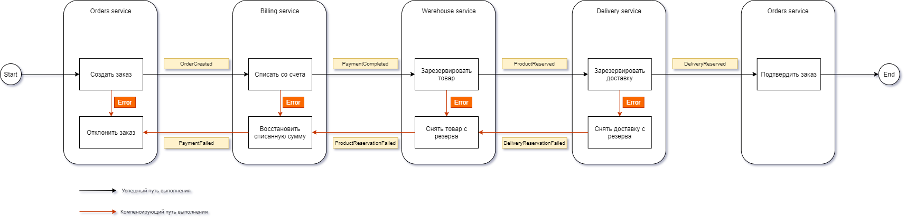

# LESSON-30 Распределенные транзакции

## Архитектура реализованного решения
  
Для выполнения задания выбран вариант реализации `Event Collaboration` с хореографической Сагой.  
  
Потоки событий транзакций и противотранзакций представлены на схеме  
  
  
  
## Развертывание 
  
Дальнейшие действия подразумевают, что Nginx Ingress Controller уже установлен.  
  
Создаем и делаем дефолтным неймспейс sakurlyk-lesson30
```
kubectl create namespace sakurlyk-lesson30
kubectl config set-context --current --namespace=sakurlyk-lesson30
```

Добавление bitnami репозитория (если еще не добавляли ранее).  
Данный репозиторий понадобится для установки rabbitmq.  
  
```
helm repo add bitnami https://charts.bitnami.com/bitnami
helm repo update bitnami
```
  
Устанавливаем rabbitmq с прокидыванием пароля password  
  
```
helm -n sakurlyk-lesson30 install rabbitmq oci://registry-1.docker.io/bitnamicharts/rabbitmq --set auth.username=user,auth.password=password
```

В папке Helm выполняем команды установки сервисов  
```
helm -n sakurlyk-lesson30 install orders-chart .\orders-chart
helm -n sakurlyk-lesson30 install billing-chart .\billing-chart
helm -n sakurlyk-lesson30 install warehouse-chart .\warehouse-chart
helm -n sakurlyk-lesson30 install delivery-chart .\delivery-chart
```
  
## Ingress

Для возможности обращения к ingress.  
В качестве namespace указываем тот, в котором установлен и работает ingress контроллер.  
В примере запуска ниже указан --namespace=m  
  
```
kubectl port-forward --namespace=m service/nginx-ingress-nginx-controller 80:80
```
  
## RabbitMq
  
Для возможности обращения к UI RabbitMq:  
  
```
kubectl port-forward --namespace sakurlyk-lesson30 svc/rabbitmq 15672:15672
```
  
Подключаемся по адресу http://localhost:15672  
  
Учетные данные :  
  
```
логин: user  
пароль: password  
```
  
Пример интерфейса со списком подключений:  
  
  
  
## Тестирование
  
После установки запускаем тесты из папки 'Postman' с помощью newman и проверяем, что все корректно запустилось.  
  
```
newman run "lesson_30.postman_collection.json"
```
  
В целях тестирования введены наименования продуктов, указание которых в заказе позволяет проверить запуск компенсирующих транзакций.  
Достаточно создать заказ с заполнением в атрибуте product одного из следующих значений:  
  
- "Expensive" - сервис Биллинга не производит списание и отправляет в сервис Заказов событие о невозможности выполнения платежа,
- "Notexists" - сервис Склада не производит резервирование товара и отправляет в сервис Биллинга событие о невозможности выполнения резервирования товара,
- "LargeSized" - сервис доставки не производит резервирование доставки и отправляет в сервис Склада событие о невозможности выполнения резервирования доставки.

Результаты:

```
→ 01_Создать успешный заказ
  POST http://arch.homework/orders/create [200 OK, 275B, 72ms]
  √  [INFO] Request headers: [{"key":"Content-Type","value":"application/json","system":true},{"key":"User-Agent","value":"PostmanRuntime/7.39.0","system":true},{"key":"Accept","value":"*/*","system":true},{"key":"Cache-Control","value":"no-cache","system":true},{"key":"Postman-Token","value":"b957288c-7c55-44eb-868c-0d2e0bdbc900","system":true},{"key":"Host","value":"arch.homework","system":true},{"key":"Accept-Encoding","value":"gzip, deflate, br","system":true},{"key":"Connection","value":"keep-alive","system":true},{"key":"Content-Length","value":"59","system":true}]
  √  [INFO] Request body: {
  "product": "some_product",
  "totalPrice": "100.0"
}
  √  [INFO] Response headers: [{"key":"Date","value":"Mon, 24 Jun 2024 12:06:05 GMT"},{"key":"Content-Type","value":"application/json; charset=utf-8"},{"key":"Transfer-Encoding","value":"chunked"},{"key":"Connection","value":"keep-alive"}]
  √  [INFO] Response body: {"id":13,"product":"some_product","totalPrice":100.0,"status":"Created","createdAt":"2024-06-24T12:06:05.8279895+00:00"}
  √  HTTPStatus 200
  √  Order with totalPrice=100.0 created
```

```
→ 02_Заказ подтвержден
  GET http://arch.homework/orders [200 OK, 1.7kB, 7ms]
  √  [INFO] Request headers: [{"key":"User-Agent","value":"PostmanRuntime/7.39.0","system":true},{"key":"Accept","value":"*/*","system":true},{"key":"Cache-Control","value":"no-cache","system":true},{"key":"Postman-Token","value":"32fd8063-a684-4d6a-9b6d-3aa30fb5faf9","system":true},{"key":"Host","value":"arch.homework","system":true},{"key":"Accept-Encoding","value":"gzip, deflate, br","system":true},{"key":"Connection","value":"keep-alive","system":true}]
  √  [INFO] Request body: undefined
  √  [INFO] Response headers: [{"key":"Date","value":"Mon, 24 Jun 2024 12:06:05 GMT"},{"key":"Content-Type","value":"application/json; charset=utf-8"},{"key":"Transfer-Encoding","value":"chunked"},{"key":"Connection","value":"keep-alive"}]
  √  [INFO] Response body: [{"id":13,"product":"some_product","totalPrice":100.0,"status":"Confirmed","createdAt":"2024-06-24T12:06:05.827989+00:00"},{"id":12,"product":"LargeSized","totalPrice":100.0,"status":"Declined","createdAt":"2024-06-24T12:03:50.940207+00:00"},{"id":11,"product":"Notexists","totalPrice":100.0,"status":"Declined","createdAt":"2024-06-24T12:03:50.63172+00:00"},{"id":10,"product":"Expensive","totalPrice":100.0,"status":"Declined","createdAt":"2024-06-24T12:03:50.261766+00:00"},{"id":9,"product":"some_product","totalPrice":100.0,"status":"Confirmed","createdAt":"2024-06-24T12:03:49.898246+00:00"},{"id":8,"product":"LargeSized","totalPrice":100.0,"status":"Declined","createdAt":"2024-06-24T12:02:28.452035+00:00"},{"id":7,"product":"Notexists","totalPrice":100.0,"status":"Declined","createdAt":"2024-06-24T12:02:28.111893+00:00"},{"id":6,"product":"Expensive","totalPrice":100.0,"status":"Declined","createdAt":"2024-06-24T12:02:27.714132+00:00"},{"id":5,"product":"some_product","totalPrice":100.0,"status":"Confirmed","createdAt":"2024-06-24T12:02:27.324147+00:00"},{"id":4,"product":"LargeSized","totalPrice":100.0,"status":"Declined","createdAt":"2024-06-24T11:54:12.022283+00:00"},{"id":3,"product":"Notexists","totalPrice":100.0,"status":"Declined","createdAt":"2024-06-24T11:49:14.461142+00:00"},{"id":2,"product":"Expensive","totalPrice":100.0,"status":"Declined","createdAt":"2024-06-24T11:45:10.857771+00:00"},{"id":1,"product":"some_product","totalPrice":100.0,"status":"Confirmed","createdAt":"2024-06-24T11:34:55.820242+00:00"}]
  √  HTTPStatus 200
  √  Last order with status Confirmed
```

```
→ 03_Платёж подтвержден
  GET http://arch.homework/billing/payments [200 OK, 1.46kB, 7ms]
  √  [INFO] Request headers: [{"key":"User-Agent","value":"PostmanRuntime/7.39.0","system":true},{"key":"Accept","value":"*/*","system":true},{"key":"Cache-Control","value":"no-cache","system":true},{"key":"Postman-Token","value":"2c73bd44-8139-4fd9-b3b0-d9283c9fb639","system":true},{"key":"Host","value":"arch.homework","system":true},{"key":"Accept-Encoding","value":"gzip, deflate, br","system":true},{"key":"Connection","value":"keep-alive","system":true}]
  √  [INFO] Request body: undefined
  √  [INFO] Response headers: [{"key":"Date","value":"Mon, 24 Jun 2024 12:06:06 GMT"},{"key":"Content-Type","value":"application/json; charset=utf-8"},{"key":"Transfer-Encoding","value":"chunked"},{"key":"Connection","value":"keep-alive"}]
  √  [INFO] Response body: [{"id":10,"orderId":13,"product":"some_product","totalPrice":100.0,"status":"Charged","createdAt":"2024-06-24T12:06:05.837436+00:00"},{"id":9,"orderId":12,"product":"LargeSized","totalPrice":100.0,"status":"Returned","createdAt":"2024-06-24T12:03:50.945121+00:00"},{"id":8,"orderId":11,"product":"Notexists","totalPrice":100.0,"status":"Returned","createdAt":"2024-06-24T12:03:50.636506+00:00"},{"id":7,"orderId":9,"product":"some_product","totalPrice":100.0,"status":"Charged","createdAt":"2024-06-24T12:03:49.902882+00:00"},{"id":6,"orderId":8,"product":"LargeSized","totalPrice":100.0,"status":"Returned","createdAt":"2024-06-24T12:02:28.456626+00:00"},{"id":5,"orderId":7,"product":"Notexists","totalPrice":100.0,"status":"Returned","createdAt":"2024-06-24T12:02:28.115898+00:00"},{"id":4,"orderId":5,"product":"some_product","totalPrice":100.0,"status":"Charged","createdAt":"2024-06-24T12:02:27.336309+00:00"},{"id":3,"orderId":4,"product":"LargeSized","totalPrice":100.0,"status":"Returned","createdAt":"2024-06-24T11:54:12.034678+00:00"},{"id":2,"orderId":3,"product":"Notexists","totalPrice":100.0,"status":"Returned","createdAt":"2024-06-24T11:49:14.46913+00:00"},{"id":1,"orderId":1,"product":"some_product","totalPrice":100.0,"status":"Charged","createdAt":"2024-06-24T11:34:56.105468+00:00"}]
  √  HTTPStatus 200
  √  Last payment with status Charged
```

```
→ 04_Товар зарезервирован
  GET http://arch.homework/warehouse/reservations [200 OK, 943B, 7ms]
  √  [INFO] Request headers: [{"key":"User-Agent","value":"PostmanRuntime/7.39.0","system":true},{"key":"Accept","value":"*/*","system":true},{"key":"Cache-Control","value":"no-cache","system":true},{"key":"Postman-Token","value":"0ed59c19-bb31-4357-8598-1d3d8a2ebf23","system":true},{"key":"Host","value":"arch.homework","system":true},{"key":"Accept-Encoding","value":"gzip, deflate, br","system":true},{"key":"Connection","value":"keep-alive","system":true}]
  √  [INFO] Request body: undefined
  √  [INFO] Response headers: [{"key":"Date","value":"Mon, 24 Jun 2024 12:06:06 GMT"},{"key":"Content-Type","value":"application/json; charset=utf-8"},{"key":"Transfer-Encoding","value":"chunked"},{"key":"Connection","value":"keep-alive"}]
  √  [INFO] Response body: [{"id":7,"orderId":13,"product":"some_product","status":"Reserved","createdAt":"2024-06-24T12:06:05.842021+00:00"},{"id":6,"orderId":12,"product":"LargeSized","status":"Declined","createdAt":"2024-06-24T12:03:50.950226+00:00"},{"id":5,"orderId":9,"product":"some_product","status":"Reserved","createdAt":"2024-06-24T12:03:49.907297+00:00"},{"id":4,"orderId":8,"product":"LargeSized","status":"Declined","createdAt":"2024-06-24T12:02:28.462073+00:00"},{"id":3,"orderId":5,"product":"some_product","status":"Reserved","createdAt":"2024-06-24T12:02:27.348616+00:00"},{"id":2,"orderId":4,"product":"LargeSized","status":"Declined","createdAt":"2024-06-24T11:54:12.041791+00:00"},{"id":1,"orderId":1,"product":"some_product","status":"Reserved","createdAt":"2024-06-24T11:34:56.377054+00:00"}]
  √  HTTPStatus 200
  √  Last product reservation with status Reserved
```

```
→ 05_Доставка зарезервирована
  GET http://arch.homework/delivery [200 OK, 607B, 8ms]
  √  [INFO] Request headers: [{"key":"User-Agent","value":"PostmanRuntime/7.39.0","system":true},{"key":"Accept","value":"*/*","system":true},{"key":"Cache-Control","value":"no-cache","system":true},{"key":"Postman-Token","value":"6aed60ba-0a39-4210-bfc1-21647472f89c","system":true},{"key":"Host","value":"arch.homework","system":true},{"key":"Accept-Encoding","value":"gzip, deflate, br","system":true},{"key":"Connection","value":"keep-alive","system":true}]
  √  [INFO] Request body: undefined
  √  [INFO] Response headers: [{"key":"Date","value":"Mon, 24 Jun 2024 12:06:06 GMT"},{"key":"Content-Type","value":"application/json; charset=utf-8"},{"key":"Transfer-Encoding","value":"chunked"},{"key":"Connection","value":"keep-alive"}]
  √  [INFO] Response body: [{"id":4,"orderId":13,"product":"some_product","status":"Reserved","createdAt":"2024-06-24T12:06:05.8475+00:00"},{"id":3,"orderId":9,"product":"some_product","status":"Reserved","createdAt":"2024-06-24T12:03:49.915116+00:00"},{"id":2,"orderId":5,"product":"some_product","status":"Reserved","createdAt":"2024-06-24T12:02:27.363452+00:00"},{"id":1,"orderId":1,"product":"some_product","status":"Reserved","createdAt":"2024-06-24T11:34:56.637259+00:00"}]
  √  HTTPStatus 200
  √  Last delivery reservation with status Reserved
```

```
→ 06_Создать заказ с ошибкой оплаты
  POST http://arch.homework/orders/create [200 OK, 272B, 10ms]
  √  [INFO] Request headers: [{"key":"Content-Type","value":"application/json","system":true},{"key":"User-Agent","value":"PostmanRuntime/7.39.0","system":true},{"key":"Accept","value":"*/*","system":true},{"key":"Cache-Control","value":"no-cache","system":true},{"key":"Postman-Token","value":"b1a4c3ee-6ca9-497e-a77f-9501b98a7767","system":true},{"key":"Host","value":"arch.homework","system":true},{"key":"Accept-Encoding","value":"gzip, deflate, br","system":true},{"key":"Connection","value":"keep-alive","system":true},{"key":"Content-Length","value":"56","system":true}]
  √  [INFO] Request body: {
  "product": "Expensive",
  "totalPrice": "100.0"
}
  √  [INFO] Response headers: [{"key":"Date","value":"Mon, 24 Jun 2024 12:06:06 GMT"},{"key":"Content-Type","value":"application/json; charset=utf-8"},{"key":"Transfer-Encoding","value":"chunked"},{"key":"Connection","value":"keep-alive"}]
  √  [INFO] Response body: {"id":14,"product":"Expensive","totalPrice":100.0,"status":"Created","createdAt":"2024-06-24T12:06:06.3104719+00:00"}
  √  HTTPStatus 200
  √  Order with totalPrice=100.0 created
```

```
→ 07_Заказ отклонён
  GET http://arch.homework/orders [200 OK, 1.82kB, 6ms]
  √  [INFO] Request headers: [{"key":"User-Agent","value":"PostmanRuntime/7.39.0","system":true},{"key":"Accept","value":"*/*","system":true},{"key":"Cache-Control","value":"no-cache","system":true},{"key":"Postman-Token","value":"85718847-fd90-4063-9c33-ac7dc83a1103","system":true},{"key":"Host","value":"arch.homework","system":true},{"key":"Accept-Encoding","value":"gzip, deflate, br","system":true},{"key":"Connection","value":"keep-alive","system":true}]
  √  [INFO] Request body: undefined
  √  [INFO] Response headers: [{"key":"Date","value":"Mon, 24 Jun 2024 12:06:06 GMT"},{"key":"Content-Type","value":"application/json; charset=utf-8"},{"key":"Transfer-Encoding","value":"chunked"},{"key":"Connection","value":"keep-alive"}]
  √  [INFO] Response body: [{"id":14,"product":"Expensive","totalPrice":100.0,"status":"Declined","createdAt":"2024-06-24T12:06:06.310471+00:00"},{"id":13,"product":"some_product","totalPrice":100.0,"status":"Confirmed","createdAt":"2024-06-24T12:06:05.827989+00:00"},{"id":12,"product":"LargeSized","totalPrice":100.0,"status":"Declined","createdAt":"2024-06-24T12:03:50.940207+00:00"},{"id":11,"product":"Notexists","totalPrice":100.0,"status":"Declined","createdAt":"2024-06-24T12:03:50.63172+00:00"},{"id":10,"product":"Expensive","totalPrice":100.0,"status":"Declined","createdAt":"2024-06-24T12:03:50.261766+00:00"},{"id":9,"product":"some_product","totalPrice":100.0,"status":"Confirmed","createdAt":"2024-06-24T12:03:49.898246+00:00"},{"id":8,"product":"LargeSized","totalPrice":100.0,"status":"Declined","createdAt":"2024-06-24T12:02:28.452035+00:00"},{"id":7,"product":"Notexists","totalPrice":100.0,"status":"Declined","createdAt":"2024-06-24T12:02:28.111893+00:00"},{"id":6,"product":"Expensive","totalPrice":100.0,"status":"Declined","createdAt":"2024-06-24T12:02:27.714132+00:00"},{"id":5,"product":"some_product","totalPrice":100.0,"status":"Confirmed","createdAt":"2024-06-24T12:02:27.324147+00:00"},{"id":4,"product":"LargeSized","totalPrice":100.0,"status":"Declined","createdAt":"2024-06-24T11:54:12.022283+00:00"},{"id":3,"product":"Notexists","totalPrice":100.0,"status":"Declined","createdAt":"2024-06-24T11:49:14.461142+00:00"},{"id":2,"product":"Expensive","totalPrice":100.0,"status":"Declined","createdAt":"2024-06-24T11:45:10.857771+00:00"},{"id":1,"product":"some_product","totalPrice":100.0,"status":"Confirmed","createdAt":"2024-06-24T11:34:55.820242+00:00"}]
  √  HTTPStatus 200
  √  Last order with status Declined
```

```
→ 08_Платёж по последнему заказу не создавался
  GET http://arch.homework/billing/payments [200 OK, 1.46kB, 7ms]
  √  [INFO] Request headers: [{"key":"User-Agent","value":"PostmanRuntime/7.39.0","system":true},{"key":"Accept","value":"*/*","system":true},{"key":"Cache-Control","value":"no-cache","system":true},{"key":"Postman-Token","value":"f0ea4548-48cb-4796-a3f4-d8d2a8f3c7c3","system":true},{"key":"Host","value":"arch.homework","system":true},{"key":"Accept-Encoding","value":"gzip, deflate, br","system":true},{"key":"Connection","value":"keep-alive","system":true}]
  √  [INFO] Request body: undefined
  √  [INFO] Response headers: [{"key":"Date","value":"Mon, 24 Jun 2024 12:06:06 GMT"},{"key":"Content-Type","value":"application/json; charset=utf-8"},{"key":"Transfer-Encoding","value":"chunked"},{"key":"Connection","value":"keep-alive"}]
  √  [INFO] Response body: [{"id":10,"orderId":13,"product":"some_product","totalPrice":100.0,"status":"Charged","createdAt":"2024-06-24T12:06:05.837436+00:00"},{"id":9,"orderId":12,"product":"LargeSized","totalPrice":100.0,"status":"Returned","createdAt":"2024-06-24T12:03:50.945121+00:00"},{"id":8,"orderId":11,"product":"Notexists","totalPrice":100.0,"status":"Returned","createdAt":"2024-06-24T12:03:50.636506+00:00"},{"id":7,"orderId":9,"product":"some_product","totalPrice":100.0,"status":"Charged","createdAt":"2024-06-24T12:03:49.902882+00:00"},{"id":6,"orderId":8,"product":"LargeSized","totalPrice":100.0,"status":"Returned","createdAt":"2024-06-24T12:02:28.456626+00:00"},{"id":5,"orderId":7,"product":"Notexists","totalPrice":100.0,"status":"Returned","createdAt":"2024-06-24T12:02:28.115898+00:00"},{"id":4,"orderId":5,"product":"some_product","totalPrice":100.0,"status":"Charged","createdAt":"2024-06-24T12:02:27.336309+00:00"},{"id":3,"orderId":4,"product":"LargeSized","totalPrice":100.0,"status":"Returned","createdAt":"2024-06-24T11:54:12.034678+00:00"},{"id":2,"orderId":3,"product":"Notexists","totalPrice":100.0,"status":"Returned","createdAt":"2024-06-24T11:49:14.46913+00:00"},{"id":1,"orderId":1,"product":"some_product","totalPrice":100.0,"status":"Charged","createdAt":"2024-06-24T11:34:56.105468+00:00"}]
  √  HTTPStatus 200
  √  Order in last payment is not exist
```

```
→ 09_Резерв склада по последнему заказу не создавался
  GET http://arch.homework/warehouse/reservations [200 OK, 943B, 7ms]
  √  [INFO] Request headers: [{"key":"User-Agent","value":"PostmanRuntime/7.39.0","system":true},{"key":"Accept","value":"*/*","system":true},{"key":"Cache-Control","value":"no-cache","system":true},{"key":"Postman-Token","value":"a0dad724-9c45-4eaa-a4fb-3ada94316b2a","system":true},{"key":"Host","value":"arch.homework","system":true},{"key":"Accept-Encoding","value":"gzip, deflate, br","system":true},{"key":"Connection","value":"keep-alive","system":true}]
  √  [INFO] Request body: undefined
  √  [INFO] Response headers: [{"key":"Date","value":"Mon, 24 Jun 2024 12:06:06 GMT"},{"key":"Content-Type","value":"application/json; charset=utf-8"},{"key":"Transfer-Encoding","value":"chunked"},{"key":"Connection","value":"keep-alive"}]
  √  [INFO] Response body: [{"id":7,"orderId":13,"product":"some_product","status":"Reserved","createdAt":"2024-06-24T12:06:05.842021+00:00"},{"id":6,"orderId":12,"product":"LargeSized","status":"Declined","createdAt":"2024-06-24T12:03:50.950226+00:00"},{"id":5,"orderId":9,"product":"some_product","status":"Reserved","createdAt":"2024-06-24T12:03:49.907297+00:00"},{"id":4,"orderId":8,"product":"LargeSized","status":"Declined","createdAt":"2024-06-24T12:02:28.462073+00:00"},{"id":3,"orderId":5,"product":"some_product","status":"Reserved","createdAt":"2024-06-24T12:02:27.348616+00:00"},{"id":2,"orderId":4,"product":"LargeSized","status":"Declined","createdAt":"2024-06-24T11:54:12.041791+00:00"},{"id":1,"orderId":1,"product":"some_product","status":"Reserved","createdAt":"2024-06-24T11:34:56.377054+00:00"}]
  √  HTTPStatus 200
  √  Order in last product reservation is not exist
```

```
→ 10_Резерв доставки по последнему заказу не создавался
  GET http://arch.homework/delivery [200 OK, 607B, 7ms]
  √  [INFO] Request headers: [{"key":"User-Agent","value":"PostmanRuntime/7.39.0","system":true},{"key":"Accept","value":"*/*","system":true},{"key":"Cache-Control","value":"no-cache","system":true},{"key":"Postman-Token","value":"9972cc4f-a161-4aa4-aa42-5847ed5c09df","system":true},{"key":"Host","value":"arch.homework","system":true},{"key":"Accept-Encoding","value":"gzip, deflate, br","system":true},{"key":"Connection","value":"keep-alive","system":true}]
  √  [INFO] Request body: undefined
  √  [INFO] Response headers: [{"key":"Date","value":"Mon, 24 Jun 2024 12:06:06 GMT"},{"key":"Content-Type","value":"application/json; charset=utf-8"},{"key":"Transfer-Encoding","value":"chunked"},{"key":"Connection","value":"keep-alive"}]
  √  [INFO] Response body: [{"id":4,"orderId":13,"product":"some_product","status":"Reserved","createdAt":"2024-06-24T12:06:05.8475+00:00"},{"id":3,"orderId":9,"product":"some_product","status":"Reserved","createdAt":"2024-06-24T12:03:49.915116+00:00"},{"id":2,"orderId":5,"product":"some_product","status":"Reserved","createdAt":"2024-06-24T12:02:27.363452+00:00"},{"id":1,"orderId":1,"product":"some_product","status":"Reserved","createdAt":"2024-06-24T11:34:56.637259+00:00"}]
  √  HTTPStatus 200
  √  Order in last delivery reservation is not exist
```

```
→ 11_Создать заказ с ошибкой резервирования продукта
  POST http://arch.homework/orders/create [200 OK, 272B, 11ms]
  √  [INFO] Request headers: [{"key":"Content-Type","value":"application/json","system":true},{"key":"User-Agent","value":"PostmanRuntime/7.39.0","system":true},{"key":"Accept","value":"*/*","system":true},{"key":"Cache-Control","value":"no-cache","system":true},{"key":"Postman-Token","value":"69b302b8-edeb-42b9-85c8-147d62405c69","system":true},{"key":"Host","value":"arch.homework","system":true},{"key":"Accept-Encoding","value":"gzip, deflate, br","system":true},{"key":"Connection","value":"keep-alive","system":true},{"key":"Content-Length","value":"56","system":true}]
  √  [INFO] Request body: {
  "product": "Notexists",
  "totalPrice": "100.0"
}
  √  [INFO] Response headers: [{"key":"Date","value":"Mon, 24 Jun 2024 12:06:06 GMT"},{"key":"Content-Type","value":"application/json; charset=utf-8"},{"key":"Transfer-Encoding","value":"chunked"},{"key":"Connection","value":"keep-alive"}]
  √  [INFO] Response body: {"id":15,"product":"Notexists","totalPrice":100.0,"status":"Created","createdAt":"2024-06-24T12:06:06.7737299+00:00"}
  √  HTTPStatus 200
  √  Order with totalPrice=100.0 created
```

```
→ 12_Заказ отклонён
  GET http://arch.homework/orders [200 OK, 1.94kB, 5ms]
  √  [INFO] Request headers: [{"key":"User-Agent","value":"PostmanRuntime/7.39.0","system":true},{"key":"Accept","value":"*/*","system":true},{"key":"Cache-Control","value":"no-cache","system":true},{"key":"Postman-Token","value":"dea4120c-13f8-4d60-95ea-15f665e88bcb","system":true},{"key":"Host","value":"arch.homework","system":true},{"key":"Accept-Encoding","value":"gzip, deflate, br","system":true},{"key":"Connection","value":"keep-alive","system":true}]
  √  [INFO] Request body: undefined
  √  [INFO] Response headers: [{"key":"Date","value":"Mon, 24 Jun 2024 12:06:06 GMT"},{"key":"Content-Type","value":"application/json; charset=utf-8"},{"key":"Transfer-Encoding","value":"chunked"},{"key":"Connection","value":"keep-alive"}]
  √  [INFO] Response body: [{"id":15,"product":"Notexists","totalPrice":100.0,"status":"Declined","createdAt":"2024-06-24T12:06:06.773729+00:00"},{"id":14,"product":"Expensive","totalPrice":100.0,"status":"Declined","createdAt":"2024-06-24T12:06:06.310471+00:00"},{"id":13,"product":"some_product","totalPrice":100.0,"status":"Confirmed","createdAt":"2024-06-24T12:06:05.827989+00:00"},{"id":12,"product":"LargeSized","totalPrice":100.0,"status":"Declined","createdAt":"2024-06-24T12:03:50.940207+00:00"},{"id":11,"product":"Notexists","totalPrice":100.0,"status":"Declined","createdAt":"2024-06-24T12:03:50.63172+00:00"},{"id":10,"product":"Expensive","totalPrice":100.0,"status":"Declined","createdAt":"2024-06-24T12:03:50.261766+00:00"},{"id":9,"product":"some_product","totalPrice":100.0,"status":"Confirmed","createdAt":"2024-06-24T12:03:49.898246+00:00"},{"id":8,"product":"LargeSized","totalPrice":100.0,"status":"Declined","createdAt":"2024-06-24T12:02:28.452035+00:00"},{"id":7,"product":"Notexists","totalPrice":100.0,"status":"Declined","createdAt":"2024-06-24T12:02:28.111893+00:00"},{"id":6,"product":"Expensive","totalPrice":100.0,"status":"Declined","createdAt":"2024-06-24T12:02:27.714132+00:00"},{"id":5,"product":"some_product","totalPrice":100.0,"status":"Confirmed","createdAt":"2024-06-24T12:02:27.324147+00:00"},{"id":4,"product":"LargeSized","totalPrice":100.0,"status":"Declined","createdAt":"2024-06-24T11:54:12.022283+00:00"},{"id":3,"product":"Notexists","totalPrice":100.0,"status":"Declined","createdAt":"2024-06-24T11:49:14.461142+00:00"},{"id":2,"product":"Expensive","totalPrice":100.0,"status":"Declined","createdAt":"2024-06-24T11:45:10.857771+00:00"},{"id":1,"product":"some_product","totalPrice":100.0,"status":"Confirmed","createdAt":"2024-06-24T11:34:55.820242+00:00"}]
  √  HTTPStatus 200
  √  Last order with status Declined
```

```
→ 13_Платёж по последнему заказу возвращен
  GET http://arch.homework/billing/payments [200 OK, 1.59kB, 6ms]
  √  [INFO] Request headers: [{"key":"User-Agent","value":"PostmanRuntime/7.39.0","system":true},{"key":"Accept","value":"*/*","system":true},{"key":"Cache-Control","value":"no-cache","system":true},{"key":"Postman-Token","value":"0916e5ac-5f4d-4d3f-9fac-af1cc41de8d3","system":true},{"key":"Host","value":"arch.homework","system":true},{"key":"Accept-Encoding","value":"gzip, deflate, br","system":true},{"key":"Connection","value":"keep-alive","system":true}]
  √  [INFO] Request body: undefined
  √  [INFO] Response headers: [{"key":"Date","value":"Mon, 24 Jun 2024 12:06:06 GMT"},{"key":"Content-Type","value":"application/json; charset=utf-8"},{"key":"Transfer-Encoding","value":"chunked"},{"key":"Connection","value":"keep-alive"}]
  √  [INFO] Response body: [{"id":11,"orderId":15,"product":"Notexists","totalPrice":100.0,"status":"Returned","createdAt":"2024-06-24T12:06:06.777205+00:00"},{"id":10,"orderId":13,"product":"some_product","totalPrice":100.0,"status":"Charged","createdAt":"2024-06-24T12:06:05.837436+00:00"},{"id":9,"orderId":12,"product":"LargeSized","totalPrice":100.0,"status":"Returned","createdAt":"2024-06-24T12:03:50.945121+00:00"},{"id":8,"orderId":11,"product":"Notexists","totalPrice":100.0,"status":"Returned","createdAt":"2024-06-24T12:03:50.636506+00:00"},{"id":7,"orderId":9,"product":"some_product","totalPrice":100.0,"status":"Charged","createdAt":"2024-06-24T12:03:49.902882+00:00"},{"id":6,"orderId":8,"product":"LargeSized","totalPrice":100.0,"status":"Returned","createdAt":"2024-06-24T12:02:28.456626+00:00"},{"id":5,"orderId":7,"product":"Notexists","totalPrice":100.0,"status":"Returned","createdAt":"2024-06-24T12:02:28.115898+00:00"},{"id":4,"orderId":5,"product":"some_product","totalPrice":100.0,"status":"Charged","createdAt":"2024-06-24T12:02:27.336309+00:00"},{"id":3,"orderId":4,"product":"LargeSized","totalPrice":100.0,"status":"Returned","createdAt":"2024-06-24T11:54:12.034678+00:00"},{"id":2,"orderId":3,"product":"Notexists","totalPrice":100.0,"status":"Returned","createdAt":"2024-06-24T11:49:14.46913+00:00"},{"id":1,"orderId":1,"product":"some_product","totalPrice":100.0,"status":"Charged","createdAt":"2024-06-24T11:34:56.105468+00:00"}]
  √  HTTPStatus 200
  √  Last payment with status Returned
```

```
→ 14_Резерв склада по последнему заказу не создавался
  GET http://arch.homework/warehouse/reservations [200 OK, 943B, 7ms]
  √  [INFO] Request headers: [{"key":"User-Agent","value":"PostmanRuntime/7.39.0","system":true},{"key":"Accept","value":"*/*","system":true},{"key":"Cache-Control","value":"no-cache","system":true},{"key":"Postman-Token","value":"9ab921b1-9db5-4c97-903b-f889f7f98e78","system":true},{"key":"Host","value":"arch.homework","system":true},{"key":"Accept-Encoding","value":"gzip, deflate, br","system":true},{"key":"Connection","value":"keep-alive","system":true}]
  √  [INFO] Request body: undefined
  √  [INFO] Response headers: [{"key":"Date","value":"Mon, 24 Jun 2024 12:06:07 GMT"},{"key":"Content-Type","value":"application/json; charset=utf-8"},{"key":"Transfer-Encoding","value":"chunked"},{"key":"Connection","value":"keep-alive"}]
  √  [INFO] Response body: [{"id":7,"orderId":13,"product":"some_product","status":"Reserved","createdAt":"2024-06-24T12:06:05.842021+00:00"},{"id":6,"orderId":12,"product":"LargeSized","status":"Declined","createdAt":"2024-06-24T12:03:50.950226+00:00"},{"id":5,"orderId":9,"product":"some_product","status":"Reserved","createdAt":"2024-06-24T12:03:49.907297+00:00"},{"id":4,"orderId":8,"product":"LargeSized","status":"Declined","createdAt":"2024-06-24T12:02:28.462073+00:00"},{"id":3,"orderId":5,"product":"some_product","status":"Reserved","createdAt":"2024-06-24T12:02:27.348616+00:00"},{"id":2,"orderId":4,"product":"LargeSized","status":"Declined","createdAt":"2024-06-24T11:54:12.041791+00:00"},{"id":1,"orderId":1,"product":"some_product","status":"Reserved","createdAt":"2024-06-24T11:34:56.377054+00:00"}]
  √  HTTPStatus 200
  √  Order in last product reservation is not exist
```

```
→ 15_Резерв доставки по последнему заказу не создавался
  GET http://arch.homework/delivery [200 OK, 607B, 6ms]
  √  [INFO] Request headers: [{"key":"User-Agent","value":"PostmanRuntime/7.39.0","system":true},{"key":"Accept","value":"*/*","system":true},{"key":"Cache-Control","value":"no-cache","system":true},{"key":"Postman-Token","value":"9b3cc7d1-4267-4ebc-8fa2-06d4c1ae27d7","system":true},{"key":"Host","value":"arch.homework","system":true},{"key":"Accept-Encoding","value":"gzip, deflate, br","system":true},{"key":"Connection","value":"keep-alive","system":true}]
  √  [INFO] Request body: undefined
  √  [INFO] Response headers: [{"key":"Date","value":"Mon, 24 Jun 2024 12:06:07 GMT"},{"key":"Content-Type","value":"application/json; charset=utf-8"},{"key":"Transfer-Encoding","value":"chunked"},{"key":"Connection","value":"keep-alive"}]
  √  [INFO] Response body: [{"id":4,"orderId":13,"product":"some_product","status":"Reserved","createdAt":"2024-06-24T12:06:05.8475+00:00"},{"id":3,"orderId":9,"product":"some_product","status":"Reserved","createdAt":"2024-06-24T12:03:49.915116+00:00"},{"id":2,"orderId":5,"product":"some_product","status":"Reserved","createdAt":"2024-06-24T12:02:27.363452+00:00"},{"id":1,"orderId":1,"product":"some_product","status":"Reserved","createdAt":"2024-06-24T11:34:56.637259+00:00"}]
  √  HTTPStatus 200
  √  Order in last delivery reservation is not exist
```

```
→ 16_Создать заказ с ошибкой резервирования доставки
  POST http://arch.homework/orders/create [200 OK, 273B, 13ms]
  √  [INFO] Request headers: [{"key":"Content-Type","value":"application/json","system":true},{"key":"User-Agent","value":"PostmanRuntime/7.39.0","system":true},{"key":"Accept","value":"*/*","system":true},{"key":"Cache-Control","value":"no-cache","system":true},{"key":"Postman-Token","value":"6d384f82-9515-48af-aa52-e680420591b3","system":true},{"key":"Host","value":"arch.homework","system":true},{"key":"Accept-Encoding","value":"gzip, deflate, br","system":true},{"key":"Connection","value":"keep-alive","system":true},{"key":"Content-Length","value":"57","system":true}]
  √  [INFO] Request body: {
  "product": "LargeSized",
  "totalPrice": "100.0"
}
  √  [INFO] Response headers: [{"key":"Date","value":"Mon, 24 Jun 2024 12:06:07 GMT"},{"key":"Content-Type","value":"application/json; charset=utf-8"},{"key":"Transfer-Encoding","value":"chunked"},{"key":"Connection","value":"keep-alive"}]
  √  [INFO] Response body: {"id":16,"product":"LargeSized","totalPrice":100.0,"status":"Created","createdAt":"2024-06-24T12:06:07.2245697+00:00"}
  √  HTTPStatus 200
  √  Order with totalPrice=100.0 created
```

```
→ 17_Заказ отклонён
  GET http://arch.homework/orders [200 OK, 2.05kB, 5ms]
  √  [INFO] Request headers: [{"key":"User-Agent","value":"PostmanRuntime/7.39.0","system":true},{"key":"Accept","value":"*/*","system":true},{"key":"Cache-Control","value":"no-cache","system":true},{"key":"Postman-Token","value":"60852a5c-1a87-4658-8734-208fd62b3d84","system":true},{"key":"Host","value":"arch.homework","system":true},{"key":"Accept-Encoding","value":"gzip, deflate, br","system":true},{"key":"Connection","value":"keep-alive","system":true}]
  √  [INFO] Request body: undefined
  √  [INFO] Response headers: [{"key":"Date","value":"Mon, 24 Jun 2024 12:06:07 GMT"},{"key":"Content-Type","value":"application/json; charset=utf-8"},{"key":"Transfer-Encoding","value":"chunked"},{"key":"Connection","value":"keep-alive"}]
  √  [INFO] Response body: [{"id":16,"product":"LargeSized","totalPrice":100.0,"status":"Declined","createdAt":"2024-06-24T12:06:07.224569+00:00"},{"id":15,"product":"Notexists","totalPrice":100.0,"status":"Declined","createdAt":"2024-06-24T12:06:06.773729+00:00"},{"id":14,"product":"Expensive","totalPrice":100.0,"status":"Declined","createdAt":"2024-06-24T12:06:06.310471+00:00"},{"id":13,"product":"some_product","totalPrice":100.0,"status":"Confirmed","createdAt":"2024-06-24T12:06:05.827989+00:00"},{"id":12,"product":"LargeSized","totalPrice":100.0,"status":"Declined","createdAt":"2024-06-24T12:03:50.940207+00:00"},{"id":11,"product":"Notexists","totalPrice":100.0,"status":"Declined","createdAt":"2024-06-24T12:03:50.63172+00:00"},{"id":10,"product":"Expensive","totalPrice":100.0,"status":"Declined","createdAt":"2024-06-24T12:03:50.261766+00:00"},{"id":9,"product":"some_product","totalPrice":100.0,"status":"Confirmed","createdAt":"2024-06-24T12:03:49.898246+00:00"},{"id":8,"product":"LargeSized","totalPrice":100.0,"status":"Declined","createdAt":"2024-06-24T12:02:28.452035+00:00"},{"id":7,"product":"Notexists","totalPrice":100.0,"status":"Declined","createdAt":"2024-06-24T12:02:28.111893+00:00"},{"id":6,"product":"Expensive","totalPrice":100.0,"status":"Declined","createdAt":"2024-06-24T12:02:27.714132+00:00"},{"id":5,"product":"some_product","totalPrice":100.0,"status":"Confirmed","createdAt":"2024-06-24T12:02:27.324147+00:00"},{"id":4,"product":"LargeSized","totalPrice":100.0,"status":"Declined","createdAt":"2024-06-24T11:54:12.022283+00:00"},{"id":3,"product":"Notexists","totalPrice":100.0,"status":"Declined","createdAt":"2024-06-24T11:49:14.461142+00:00"},{"id":2,"product":"Expensive","totalPrice":100.0,"status":"Declined","createdAt":"2024-06-24T11:45:10.857771+00:00"},{"id":1,"product":"some_product","totalPrice":100.0,"status":"Confirmed","createdAt":"2024-06-24T11:34:55.820242+00:00"}]
  √  HTTPStatus 200
  √  Last order with status Declined
```

```
→ 18_Платёж по последнему заказу не создавался
  GET http://arch.homework/billing/payments [200 OK, 1.72kB, 6ms]
  √  [INFO] Request headers: [{"key":"User-Agent","value":"PostmanRuntime/7.39.0","system":true},{"key":"Accept","value":"*/*","system":true},{"key":"Cache-Control","value":"no-cache","system":true},{"key":"Postman-Token","value":"0b61cb52-8436-4a71-b849-004d747c9848","system":true},{"key":"Host","value":"arch.homework","system":true},{"key":"Accept-Encoding","value":"gzip, deflate, br","system":true},{"key":"Connection","value":"keep-alive","system":true}]
  √  [INFO] Request body: undefined
  √  [INFO] Response headers: [{"key":"Date","value":"Mon, 24 Jun 2024 12:06:07 GMT"},{"key":"Content-Type","value":"application/json; charset=utf-8"},{"key":"Transfer-Encoding","value":"chunked"},{"key":"Connection","value":"keep-alive"}]
  √  [INFO] Response body: [{"id":12,"orderId":16,"product":"LargeSized","totalPrice":100.0,"status":"Returned","createdAt":"2024-06-24T12:06:07.229287+00:00"},{"id":11,"orderId":15,"product":"Notexists","totalPrice":100.0,"status":"Returned","createdAt":"2024-06-24T12:06:06.777205+00:00"},{"id":10,"orderId":13,"product":"some_product","totalPrice":100.0,"status":"Charged","createdAt":"2024-06-24T12:06:05.837436+00:00"},{"id":9,"orderId":12,"product":"LargeSized","totalPrice":100.0,"status":"Returned","createdAt":"2024-06-24T12:03:50.945121+00:00"},{"id":8,"orderId":11,"product":"Notexists","totalPrice":100.0,"status":"Returned","createdAt":"2024-06-24T12:03:50.636506+00:00"},{"id":7,"orderId":9,"product":"some_product","totalPrice":100.0,"status":"Charged","createdAt":"2024-06-24T12:03:49.902882+00:00"},{"id":6,"orderId":8,"product":"LargeSized","totalPrice":100.0,"status":"Returned","createdAt":"2024-06-24T12:02:28.456626+00:00"},{"id":5,"orderId":7,"product":"Notexists","totalPrice":100.0,"status":"Returned","createdAt":"2024-06-24T12:02:28.115898+00:00"},{"id":4,"orderId":5,"product":"some_product","totalPrice":100.0,"status":"Charged","createdAt":"2024-06-24T12:02:27.336309+00:00"},{"id":3,"orderId":4,"product":"LargeSized","totalPrice":100.0,"status":"Returned","createdAt":"2024-06-24T11:54:12.034678+00:00"},{"id":2,"orderId":3,"product":"Notexists","totalPrice":100.0,"status":"Returned","createdAt":"2024-06-24T11:49:14.46913+00:00"},{"id":1,"orderId":1,"product":"some_product","totalPrice":100.0,"status":"Charged","createdAt":"2024-06-24T11:34:56.105468+00:00"}]
  √  HTTPStatus 200
  √  Last payment with status Returned
```

```
→ 19_Резерв склада по последнему заказу отклонён
  GET http://arch.homework/warehouse/reservations [200 OK, 1.06kB, 12ms]
  √  [INFO] Request headers: [{"key":"User-Agent","value":"PostmanRuntime/7.39.0","system":true},{"key":"Accept","value":"*/*","system":true},{"key":"Cache-Control","value":"no-cache","system":true},{"key":"Postman-Token","value":"4bb023c1-5ebc-44a1-a188-64e484f9cc43","system":true},{"key":"Host","value":"arch.homework","system":true},{"key":"Accept-Encoding","value":"gzip, deflate, br","system":true},{"key":"Connection","value":"keep-alive","system":true}]
  √  [INFO] Request body: undefined
  √  [INFO] Response headers: [{"key":"Date","value":"Mon, 24 Jun 2024 12:06:07 GMT"},{"key":"Content-Type","value":"application/json; charset=utf-8"},{"key":"Transfer-Encoding","value":"chunked"},{"key":"Connection","value":"keep-alive"}]
  √  [INFO] Response body: [{"id":8,"orderId":16,"product":"LargeSized","status":"Declined","createdAt":"2024-06-24T12:06:07.234833+00:00"},{"id":7,"orderId":13,"product":"some_product","status":"Reserved","createdAt":"2024-06-24T12:06:05.842021+00:00"},{"id":6,"orderId":12,"product":"LargeSized","status":"Declined","createdAt":"2024-06-24T12:03:50.950226+00:00"},{"id":5,"orderId":9,"product":"some_product","status":"Reserved","createdAt":"2024-06-24T12:03:49.907297+00:00"},{"id":4,"orderId":8,"product":"LargeSized","status":"Declined","createdAt":"2024-06-24T12:02:28.462073+00:00"},{"id":3,"orderId":5,"product":"some_product","status":"Reserved","createdAt":"2024-06-24T12:02:27.348616+00:00"},{"id":2,"orderId":4,"product":"LargeSized","status":"Declined","createdAt":"2024-06-24T11:54:12.041791+00:00"},{"id":1,"orderId":1,"product":"some_product","status":"Reserved","createdAt":"2024-06-24T11:34:56.377054+00:00"}]
  √  HTTPStatus 200
  √  Last product reservation with status Declined
```

```
→ 20_Резерв доставки по последнему заказу не создавался
  GET http://arch.homework/delivery [200 OK, 607B, 6ms]
  √  [INFO] Request headers: [{"key":"User-Agent","value":"PostmanRuntime/7.39.0","system":true},{"key":"Accept","value":"*/*","system":true},{"key":"Cache-Control","value":"no-cache","system":true},{"key":"Postman-Token","value":"a7908265-3a8b-4d05-b240-e9dec96c90f3","system":true},{"key":"Host","value":"arch.homework","system":true},{"key":"Accept-Encoding","value":"gzip, deflate, br","system":true},{"key":"Connection","value":"keep-alive","system":true}]
  √  [INFO] Request body: undefined
  √  [INFO] Response headers: [{"key":"Date","value":"Mon, 24 Jun 2024 12:06:07 GMT"},{"key":"Content-Type","value":"application/json; charset=utf-8"},{"key":"Transfer-Encoding","value":"chunked"},{"key":"Connection","value":"keep-alive"}]
  √  [INFO] Response body: [{"id":4,"orderId":13,"product":"some_product","status":"Reserved","createdAt":"2024-06-24T12:06:05.8475+00:00"},{"id":3,"orderId":9,"product":"some_product","status":"Reserved","createdAt":"2024-06-24T12:03:49.915116+00:00"},{"id":2,"orderId":5,"product":"some_product","status":"Reserved","createdAt":"2024-06-24T12:02:27.363452+00:00"},{"id":1,"orderId":1,"product":"some_product","status":"Reserved","createdAt":"2024-06-24T11:34:56.637259+00:00"}]
  √  HTTPStatus 200
  √  Order in last delivery reservation is not exist
```

```
┌─────────────────────────┬──────────────────┬──────────────────┐
│                         │         executed │           failed │
├─────────────────────────┼──────────────────┼──────────────────┤
│              iterations │                1 │                0 │
├─────────────────────────┼──────────────────┼──────────────────┤
│                requests │               20 │                0 │
├─────────────────────────┼──────────────────┼──────────────────┤
│            test-scripts │               40 │                0 │
├─────────────────────────┼──────────────────┼──────────────────┤
│      prerequest-scripts │               36 │                0 │
├─────────────────────────┼──────────────────┼──────────────────┤
│              assertions │              120 │                0 │
├─────────────────────────┴──────────────────┴──────────────────┤
│ total run duration: 1897ms                                    │
├───────────────────────────────────────────────────────────────┤
│ total data received: 18.04kB (approx)                         │
├───────────────────────────────────────────────────────────────┤
│ average response time: 10ms [min: 5ms, max: 72ms, s.d.: 14ms] │
└───────────────────────────────────────────────────────────────┘
```